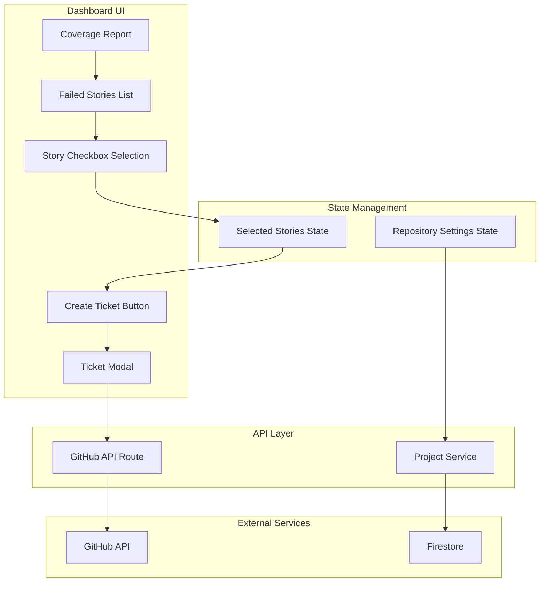
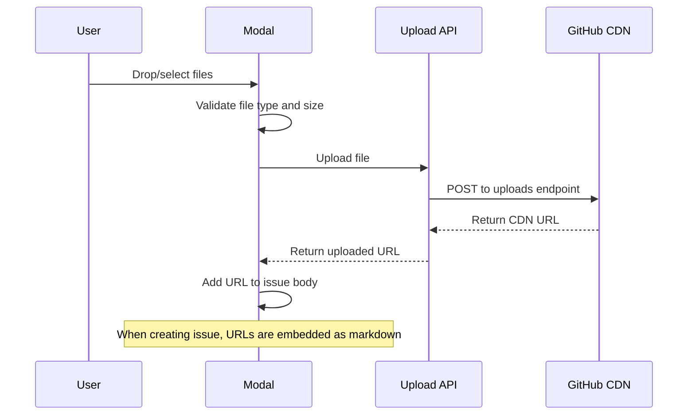
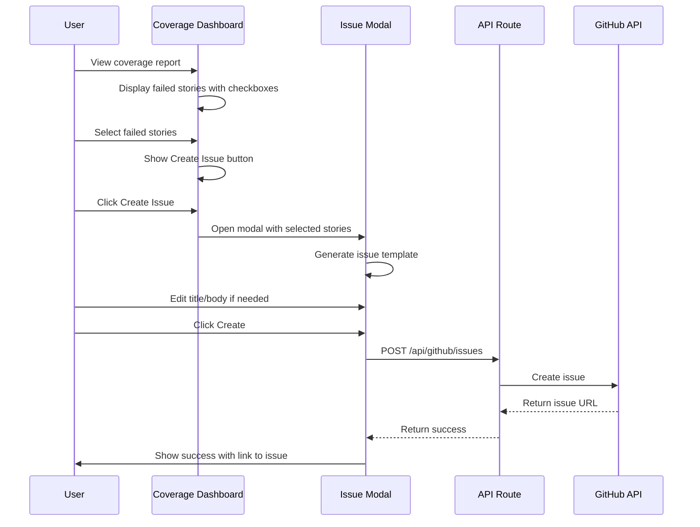

# GitHub Ticket Generation from Failed Stories

## Overview

This plan outlines the implementation for allowing users to generate GitHub issues directly from failed stories in the coverage report. Users will be able to select individual failed stories and create GitHub issues with pre-populated information about the failure.

## Current State Analysis

### Coverage Dashboard
- Located at [`scry-developer-dashboard/components/coverage/CoverageDashboard.tsx`](scry-developer-dashboard/components/coverage/CoverageDashboard.tsx)
- Displays components with their stories, including failed stories
- [`ComponentRow`](scry-developer-dashboard/components/coverage/CoverageDashboard.tsx:256) component shows component-level info but doesn't expand to show individual stories

### Coverage Data Types
From [`scry-developer-dashboard/types/coverage.ts`](scry-developer-dashboard/types/coverage.ts):
- [`StoryCoverage`](scry-developer-dashboard/types/coverage.ts:94) contains:
  - `id`: Story ID (e.g., "button--primary")
  - `name`: Story display name
  - `passed`: Boolean indicating success/failure
  - `error?`: Error message if failed
  - `propsUsed`: Props used in the story

### GitHub Integration
- GitHub OAuth is already implemented via Firebase Auth
- [`signInWithGithub()`](scry-developer-dashboard/lib/auth-helpers.ts:20) stores access token in localStorage
- [`getGithubToken()`](scry-developer-dashboard/lib/auth-helpers.ts:61) retrieves the token
- Current scopes: `read:user`, `user:email`

### Project Configuration
- [`Project`](scry-developer-dashboard/lib/types/project.types.ts:49) type does NOT currently have repository URL
- Repository configuration is marked as "coming soon" in settings
- Need to add repository URL field to enable GitHub issue creation

## Architecture



## UI Mockups

### 1. Coverage Dashboard with Expandable Components

```
┌─────────────────────────────────────────────────────────────────────────────────┐
│  Coverage Report                                                                │
│  my-project • Build #42 • Jan 25, 2026                    [View Storybook] 85%  │
├─────────────────────────────────────────────────────────────────────────────────┤
│                                                                                 │
│  ┌─────────────────┐  ┌─────────────────┐  ┌─────────────────┐                 │
│  │ Overall Coverage│  │ Components      │  │ Failing Stories │                 │
│  │      85%        │  │      24         │  │       3         │                 │
│  │ Weighted score  │  │ 20 with stories │  │ Across 2 comps  │                 │
│  └─────────────────┘  └─────────────────┘  └─────────────────┘                 │
│                                                                                 │
│  Components                                                                     │
│  ┌─────────────────────────────────────────────────────────────────────────┐   │
│  │ 🔍 Search components...                    [Filter: All Components ▼]   │   │
│  └─────────────────────────────────────────────────────────────────────────┘   │
│                                                                                 │
│  ┌─────────────────────────────────────────────────────────────────────────┐   │
│  │ ▶ Button                                              Stories: 5/5  ✓   │   │
│  │   src/components/Button.tsx                                             │   │
│  └─────────────────────────────────────────────────────────────────────────┘   │
│                                                                                 │
│  ┌─────────────────────────────────────────────────────────────────────────┐   │
│  │ ▼ SearchInterface                          [2 failing]    Stories: 3/5  │   │
│  │   src/components/SearchInterface.tsx                                    │   │
│  ├─────────────────────────────────────────────────────────────────────────┤   │
│  │   Stories:                                                              │   │
│  │   ┌─────────────────────────────────────────────────────────────────┐   │   │
│  │   │ [ ] ✓ Default                                                   │   │   │
│  │   │     Renders correctly with default props                        │   │   │
│  │   ├─────────────────────────────────────────────────────────────────┤   │   │
│  │   │ [✓] ✗ Loading State                                             │   │   │
│  │   │     Error: Cannot read property 'map' of undefined              │   │   │
│  │   ├─────────────────────────────────────────────────────────────────┤   │   │
│  │   │ [✓] ✗ With Results                                              │   │   │
│  │   │     Error: Expected element to be visible but was hidden        │   │   │
│  │   ├─────────────────────────────────────────────────────────────────┤   │   │
│  │   │ [ ] ✓ Empty State                                               │   │   │
│  │   │     Renders correctly with no results                           │   │   │
│  │   ├─────────────────────────────────────────────────────────────────┤   │   │
│  │   │ [ ] ✓ Error State                                               │   │   │
│  │   │     Displays error message correctly                            │   │   │
│  │   └─────────────────────────────────────────────────────────────────┘   │   │
│  └─────────────────────────────────────────────────────────────────────────┘   │
│                                                                                 │
│  ┌─────────────────────────────────────────────────────────────────────────┐   │
│  │ ▶ Card                                    [No Stories]    Stories: 0/0  │   │
│  │   src/components/Card.tsx                                               │   │
│  └─────────────────────────────────────────────────────────────────────────┘   │
│                                                                                 │
└─────────────────────────────────────────────────────────────────────────────────┘

┌─────────────────────────────────────────────┐
│  ╔═══════════════════════════════════════╗  │  ← Floating Action Button
│  ║  🐙 Create GitHub Issue (2 selected)  ║  │    appears when stories
│  ╚═══════════════════════════════════════╝  │    are selected
└─────────────────────────────────────────────┘
```

### 2. GitHub Issue Creation Modal

```
┌─────────────────────────────────────────────────────────────────────────────────┐
│  Create GitHub Issue                                                        [X] │
├─────────────────────────────────────────────────────────────────────────────────┤
│                                                                                 │
│  Title                                                                          │
│  ┌─────────────────────────────────────────────────────────────────────────┐   │
│  │ [Storybook] SearchInterface: 2 stories failing                          │   │
│  └─────────────────────────────────────────────────────────────────────────┘   │
│                                                                                 │
│  Description                                                                    │
│  ┌─────────────────────────────────────────────────────────────────────────┐   │
│  │ ## Failed Storybook Stories                                             │   │
│  │                                                                         │   │
│  │ **Project:** my-project                                                 │   │
│  │ **Build:** #42                                                          │   │
│  │ **Component:** SearchInterface                                          │   │
│  │                                                                         │   │
│  │ ### Failed Stories                                                      │   │
│  │                                                                         │   │
│  │ | Story | Error |                                                       │   │
│  │ |-------|-------|                                                       │   │
│  │ | Loading State | Cannot read property 'map' of undefined |             │   │
│  │ | With Results | Expected element to be visible but was hidden |        │   │
│  │                                                                         │   │
│  │ ### Steps to Reproduce                                                  │   │
│  │ 1. Run Storybook locally                                                │   │
│  │ 2. Navigate to SearchInterface                                          │   │
│  │ 3. View the failing stories                                             │   │
│  │                                                                         │   │
│  └─────────────────────────────────────────────────────────────────────────┘   │
│                                                                                 │
│  ┌─────────────────────────────┐    ┌─────────────────────────────┐            │
│  │ Labels                      │    │ Milestone                   │            │
│  │ ┌─────────────────────────┐ │    │ ┌─────────────────────────┐ │            │
│  │ │ bug, storybook       ▼  │ │    │ │ v2.1.0               ▼  │ │            │
│  │ └─────────────────────────┘ │    │ └─────────────────────────┘ │            │
│  │                             │    │                             │            │
│  │ Available:                  │    │ Available:                  │            │
│  │ ┌─────────────────────────┐ │    │ ○ None                      │            │
│  │ │ [✓] bug                 │ │    │ ○ v2.0.0 (closed)           │            │
│  │ │ [✓] storybook           │ │    │ ● v2.1.0                    │            │
│  │ │ [ ] enhancement         │ │    │ ○ v3.0.0                    │            │
│  │ │ [ ] documentation       │ │    │                             │            │
│  │ │ [ ] high-priority       │ │    │                             │            │
│  │ │ [ ] needs-triage        │ │    │                             │            │
│  │ └─────────────────────────┘ │    └─────────────────────────────┘            │
│  └─────────────────────────────┘                                               │
│                                                                                 │
│  Assignees                                                                      │
│  ┌─────────────────────────────────────────────────────────────────────────┐   │
│  │ @johndoe, @janedoe                                                   ▼  │   │
│  └─────────────────────────────────────────────────────────────────────────┘   │
│  ┌─────────────────────────────────────────────────────────────────────────┐   │
│  │ [✓] 👤 johndoe (John Doe)                                               │   │
│  │ [✓] 👤 janedoe (Jane Doe)                                               │   │
│  │ [ ] 👤 bobsmith (Bob Smith)                                             │   │
│  │ [ ] 👤 alicejones (Alice Jones)                                         │   │
│  └─────────────────────────────────────────────────────────────────────────┘   │
│                                                                                 │
│  Attachments                                                                    │
│  ┌─────────────────────────────────────────────────────────────────────────┐   │
│  │                                                                         │   │
│  │     ┌─────────────────────────────────────────────────────────────┐     │   │
│  │     │                                                             │     │   │
│  │     │              📎 Drop files here or click to upload          │     │   │
│  │     │                                                             │     │   │
│  │     │         Supports: PNG, JPG, GIF, TXT, LOG, JSON, PDF        │     │   │
│  │     │                    Max 10MB per file                        │     │   │
│  │     │                                                             │     │   │
│  │     └─────────────────────────────────────────────────────────────┘     │   │
│  │                                                                         │   │
│  │  Uploaded files:                                                        │   │
│  │  ┌─────────────────────────────────────────────────────────────────┐   │   │
│  │  │ 🖼️ screenshot-loading-state.png          245 KB    ✓ Uploaded [x] │   │   │
│  │  ├─────────────────────────────────────────────────────────────────┤   │   │
│  │  │ 📄 console-errors.txt                     12 KB    ✓ Uploaded [x] │   │   │
│  │  ├─────────────────────────────────────────────────────────────────┤   │   │
│  │  │ 📄 component-props.json                    3 KB    ⏳ Uploading...│   │   │
│  │  └─────────────────────────────────────────────────────────────────┘   │   │
│  │                                                                         │   │
│  └─────────────────────────────────────────────────────────────────────────┘   │
│                                                                                 │
├─────────────────────────────────────────────────────────────────────────────────┤
│                                                    [Cancel]  [Create Issue]     │
└─────────────────────────────────────────────────────────────────────────────────┘
```

### 3. Repository Configuration in Project Settings

```
┌─────────────────────────────────────────────────────────────────────────────────┐
│  Project Settings                                                               │
├─────────────────────────────────────────────────────────────────────────────────┤
│                                                                                 │
│  ┌─────────────────────────────────────────────────────────────────────────┐   │
│  │ General Settings                                                        │   │
│  │ Update your project information                                         │   │
│  ├─────────────────────────────────────────────────────────────────────────┤   │
│  │                                                                         │   │
│  │ Project Name                                                            │   │
│  │ ┌─────────────────────────────────────────────────────────────────┐     │   │
│  │ │ my-project                                                      │     │   │
│  │ └─────────────────────────────────────────────────────────────────┘     │   │
│  │                                                                         │   │
│  │ Description                                                             │   │
│  │ ┌─────────────────────────────────────────────────────────────────┐     │   │
│  │ │ A sample React component library                                │     │   │
│  │ └─────────────────────────────────────────────────────────────────┘     │   │
│  │                                                                         │   │
│  │                                                    [Save Changes]       │   │
│  └─────────────────────────────────────────────────────────────────────────┘   │
│                                                                                 │
│  ┌─────────────────────────────────────────────────────────────────────────┐   │
│  │ Repository Configuration                                                │   │
│  │ Connect your Git repository to enable GitHub issue creation             │   │
│  ├─────────────────────────────────────────────────────────────────────────┤   │
│  │                                                                         │   │
│  │ Git Provider                                                            │   │
│  │ ┌─────────────────────────────────────────────────────────────────┐     │   │
│  │ │ ● GitHub   ○ GitLab (coming soon)   ○ Bitbucket (coming soon)   │     │   │
│  │ └─────────────────────────────────────────────────────────────────┘     │   │
│  │                                                                         │   │
│  │ Repository URL                                                          │   │
│  │ ┌─────────────────────────────────────────────────────────────────┐     │   │
│  │ │ https://github.com/myorg/my-project                             │     │   │
│  │ └─────────────────────────────────────────────────────────────────┘     │   │
│  │ ℹ️ Enter the full URL to your repository                                │   │
│  │                                                                         │   │
│  │ Detected: Owner: myorg  |  Repository: my-project                       │   │
│  │                                                                         │   │
│  │ ┌─────────────────────────────────────────────────────────────────┐     │   │
│  │ │ ✓ Repository access verified                                    │     │   │
│  │ │   You have permission to create issues in this repository       │     │   │
│  │ └─────────────────────────────────────────────────────────────────┘     │   │
│  │                                                                         │   │
│  │                                              [Test Connection] [Save]   │   │
│  └─────────────────────────────────────────────────────────────────────────┘   │
│                                                                                 │
│  ┌─────────────────────────────────────────────────────────────────────────┐   │
│  │ Visibility                                                              │   │
│  │ Control who can access Storybook and coverage reports                   │   │
│  ├─────────────────────────────────────────────────────────────────────────┤   │
│  │ ● Public    ○ Private                                                   │   │
│  └─────────────────────────────────────────────────────────────────────────┘   │
│                                                                                 │
└─────────────────────────────────────────────────────────────────────────────────┘
```

### 4. Success State After Issue Creation

```
┌─────────────────────────────────────────────────────────────────────────────────┐
│  ✓ Issue Created Successfully                                               [X] │
├─────────────────────────────────────────────────────────────────────────────────┤
│                                                                                 │
│     ┌─────────────────────────────────────────────────────────────────────┐     │
│     │                                                                     │     │
│     │                           ✓                                         │     │
│     │                                                                     │     │
│     │              Issue #127 created successfully!                       │     │
│     │                                                                     │     │
│     │     [Storybook] SearchInterface: 2 stories failing                  │     │
│     │                                                                     │     │
│     │     Labels: bug, storybook                                          │     │
│     │     Milestone: v2.1.0                                               │     │
│     │     Assignees: @johndoe, @janedoe                                   │     │
│     │                                                                     │     │
│     └─────────────────────────────────────────────────────────────────────┘     │
│                                                                                 │
├─────────────────────────────────────────────────────────────────────────────────┤
│                                    [View on GitHub]  [Create Another]  [Done]   │
└─────────────────────────────────────────────────────────────────────────────────┘
```

### 5. Error States

```
┌─────────────────────────────────────────────────────────────────────────────────┐
│  ⚠️ Repository Not Configured                                                   │
├─────────────────────────────────────────────────────────────────────────────────┤
│                                                                                 │
│     ┌─────────────────────────────────────────────────────────────────────┐     │
│     │                                                                     │     │
│     │                           ⚠️                                         │     │
│     │                                                                     │     │
│     │         To create GitHub issues, you need to configure              │     │
│     │         your repository in project settings first.                  │     │
│     │                                                                     │     │
│     └─────────────────────────────────────────────────────────────────────┘     │
│                                                                                 │
├─────────────────────────────────────────────────────────────────────────────────┤
│                                              [Cancel]  [Go to Settings]         │
└─────────────────────────────────────────────────────────────────────────────────┘


┌─────────────────────────────────────────────────────────────────────────────────┐
│  ⚠️ GitHub Authentication Required                                              │
├─────────────────────────────────────────────────────────────────────────────────┤
│                                                                                 │
│     ┌─────────────────────────────────────────────────────────────────────┐     │
│     │                                                                     │     │
│     │                           🔐                                         │     │
│     │                                                                     │     │
│     │         Additional GitHub permissions are required to               │     │
│     │         create issues in your repository.                           │     │
│     │                                                                     │     │
│     │         Click below to authorize access.                            │     │
│     │                                                                     │     │
│     └─────────────────────────────────────────────────────────────────────┘     │
│                                                                                 │
├─────────────────────────────────────────────────────────────────────────────────┤
│                                        [Cancel]  [🐙 Authorize with GitHub]     │
└─────────────────────────────────────────────────────────────────────────────────┘
```

## Implementation Plan

### Phase 1: Project Repository Configuration

#### 1.1 Update Project Types
Add repository configuration to the Project type:

```typescript
// In lib/types/project.types.ts
export interface RepositoryConfig {
  provider: GitProvider;
  url: string;           // e.g., "https://github.com/owner/repo"
  owner: string;         // e.g., "owner"
  name: string;          // e.g., "repo"
}

export interface Project {
  // ... existing fields
  repository?: RepositoryConfig;
}
```

#### 1.2 Update Project Service
Add methods to update repository configuration:

```typescript
// In lib/services/project.service.ts
async updateRepositoryConfig(
  projectId: string, 
  config: RepositoryConfig
): Promise<void>
```

#### 1.3 Implement Repository Settings UI
Update [`ProjectSettings.tsx`](scry-developer-dashboard/components/project-detail/ProjectSettings.tsx:82-91) to allow users to configure their repository URL.

### Phase 2: GitHub OAuth Scope Enhancement

#### 2.1 Add Required Scopes
Update [`auth-helpers.ts`](scry-developer-dashboard/lib/auth-helpers.ts:13-14) to request the `repo` scope for issue creation:

```typescript
githubProvider.addScope('read:user');
githubProvider.addScope('user:email');
githubProvider.addScope('repo');  // Required for creating issues
```

#### 2.2 Handle Scope Re-authorization
Users who previously authenticated may need to re-authorize to grant the new scope. Implement a flow to detect missing permissions and prompt for re-authorization.

### Phase 3: Coverage Dashboard UI Enhancements

#### 3.1 Create Checkbox Component
Create a reusable Checkbox component:

```typescript
// components/ui/checkbox/Checkbox.tsx
export interface CheckboxProps {
  checked: boolean;
  onCheckedChange: (checked: boolean) => void;
  disabled?: boolean;
  id?: string;
}
```

#### 3.2 Expand ComponentRow to Show Stories
Modify [`ComponentRow`](scry-developer-dashboard/components/coverage/CoverageDashboard.tsx:256) to be expandable and show individual stories:

```typescript
interface ComponentRowProps {
  component: ComponentCoverage;
  selectedStories: Set<string>;
  onStorySelect: (storyId: string, selected: boolean) => void;
  repositoryConfigured: boolean;
}
```

#### 3.3 Add Selection State to CoverageDashboard
Add state management for selected stories:

```typescript
const [selectedStories, setSelectedStories] = useState<Set<string>>(new Set());
const [isTicketModalOpen, setIsTicketModalOpen] = useState(false);
```

#### 3.4 Add "Create GitHub Issue" Button
Add a floating action button or toolbar that appears when stories are selected:

```typescript
{selectedStories.size > 0 && (
  <div className="fixed bottom-6 right-6">
    <Button onClick={() => setIsTicketModalOpen(true)}>
      <GitHubIcon className="mr-2 h-4 w-4" />
      Create Issue ({selectedStories.size} stories)
    </Button>
  </div>
)}
```

### Phase 4: GitHub Issue Creation Modal

#### 4.1 Create GitHubIssueModal Component
New component for configuring and creating the issue:

```typescript
// components/coverage/GitHubIssueModal.tsx
interface GitHubIssueModalProps {
  isOpen: boolean;
  onClose: () => void;
  selectedStories: StoryCoverage[];
  componentName: string;
  projectName: string;
  buildNumber: number;
  repository: RepositoryConfig;
}
```

#### 4.2 Issue Template Generation
Generate a well-formatted issue body:

```markdown
## Failed Storybook Stories

**Project:** {projectName}
**Build:** #{buildNumber}
**Component:** {componentName}

### Failed Stories

| Story | Error |
|-------|-------|
| {storyName} | {errorMessage} |

### Steps to Reproduce
1. Run Storybook locally
2. Navigate to the component: {componentName}
3. View the failing story: {storyName}

### Additional Context
- Coverage Report: {coverageReportUrl}
- Storybook URL: {storybookUrl}
```

#### 4.3 Allow Issue Customization
- Editable title (pre-filled with component/story info)
- Editable body (pre-filled with template)
- **Label selection** - Multi-select dropdown populated from repository labels
- **Milestone selection** - Dropdown populated from open repository milestones
- **Assignee selection** - Multi-select dropdown populated from repository collaborators

#### 4.4 Repository Metadata Loading
When the modal opens, fetch repository metadata in parallel:

```typescript
// In GitHubIssueModal.tsx
const { data: labels, isLoading: labelsLoading } = useGitHubLabels(owner, repo);
const { data: milestones, isLoading: milestonesLoading } = useGitHubMilestones(owner, repo);
const { data: collaborators, isLoading: collaboratorsLoading } = useGitHubCollaborators(owner, repo);
```

#### 4.5 Modal UI Layout

```
┌─────────────────────────────────────────────────────────────┐
│  Create GitHub Issue                                    [X] │
├─────────────────────────────────────────────────────────────┤
│                                                             │
│  Title                                                      │
│  ┌─────────────────────────────────────────────────────┐   │
│  │ [Storybook] Button: Primary story failing           │   │
│  └─────────────────────────────────────────────────────┘   │
│                                                             │
│  Description                                                │
│  ┌─────────────────────────────────────────────────────┐   │
│  │ ## Failed Storybook Stories                         │   │
│  │ **Project:** my-app                                 │   │
│  │ **Build:** #42                                      │   │
│  │ ...                                                 │   │
│  └─────────────────────────────────────────────────────┘   │
│                                                             │
│  Labels                              Milestone              │
│  ┌──────────────────────┐           ┌──────────────────┐   │
│  │ bug, storybook    ▼  │           │ v2.0.0        ▼  │   │
│  └──────────────────────┘           └──────────────────┘   │
│                                                             │
│  Assignees                                                  │
│  ┌─────────────────────────────────────────────────────┐   │
│  │ @johndoe, @janedoe                               ▼  │   │
│  └─────────────────────────────────────────────────────┘   │
│                                                             │
│  Attachments                                                │
│  ┌─────────────────────────────────────────────────────┐   │
│  │ 📎 Drop files here or click to upload               │   │
│  │    screenshot.png (245 KB)                      [x]  │   │
│  │    error-log.txt (12 KB)                        [x]  │   │
│  └─────────────────────────────────────────────────────┘   │
│                                                             │
├─────────────────────────────────────────────────────────────┤
│                              [Cancel]  [Create Issue]       │
└─────────────────────────────────────────────────────────────┘
```

### Phase 5: File Attachments

#### 5.1 Attachment Upload Strategy
GitHub Issues API does not support direct file attachments. Files must be uploaded separately and embedded as markdown links in the issue body.

**Option A: GitHub User Content Upload (Recommended)**
- Upload files to GitHub's user content CDN via the repository uploads endpoint
- Files are hosted on `user-images.githubusercontent.com`
- Requires `repo` scope (already included)

**Option B: Store in R2 and Link**
- Upload files to our existing R2 storage
- Generate public URLs and embed in issue body
- More control but adds infrastructure dependency

#### 5.2 Attachment Component

```typescript
// components/coverage/AttachmentUploader.tsx
interface AttachmentUploaderProps {
  attachments: Attachment[];
  onAttachmentsChange: (attachments: Attachment[]) => void;
  maxFiles?: number;        // Default: 5
  maxSizeBytes?: number;    // Default: 10MB per file
  acceptedTypes?: string[]; // Default: images, text, logs
}

interface Attachment {
  id: string;
  file: File;
  name: string;
  size: number;
  type: string;
  uploadStatus: 'pending' | 'uploading' | 'uploaded' | 'error';
  uploadedUrl?: string;
  error?: string;
}
```

#### 5.3 Supported File Types
| Type | Extensions | Max Size |
|------|------------|----------|
| Images | `.png`, `.jpg`, `.jpeg`, `.gif`, `.webp` | 10 MB |
| Text/Logs | `.txt`, `.log`, `.json` | 5 MB |
| Documents | `.md`, `.pdf` | 5 MB |

#### 5.4 Upload Flow



#### 5.5 Embedding Attachments in Issue Body

```markdown
## Failed Storybook Stories
...existing content...

### Attachments

[error-log.txt](https://user-images.githubusercontent.com/xxx/error-log.txt)
```

### Phase 6: GitHub API Integration

#### 5.1 Create API Route
Create a Next.js API route for GitHub issue creation:

```typescript
// app/api/github/issues/route.ts
export async function POST(request: Request) {
  // Validate user authentication
  // Extract GitHub token from request
  // Create issue via GitHub API
  // Return created issue URL
}
```

#### 5.2 GitHub API Client
Create a service for GitHub API interactions:

```typescript
// lib/services/github.service.ts
export class GitHubService {
  constructor(private accessToken: string) {}
  
  async createIssue(
    owner: string,
    repo: string,
    title: string,
    body: string,
    options?: {
      labels?: string[];
      assignees?: string[];
      milestone?: number;
    }
  ): Promise<GitHubIssue>
  
  // Fetch available labels from the repository
  async getRepositoryLabels(
    owner: string,
    repo: string
  ): Promise<GitHubLabel[]>
  
  // Fetch available milestones from the repository
  async getRepositoryMilestones(
    owner: string,
    repo: string
  ): Promise<GitHubMilestone[]>
  
  // Fetch repository collaborators for assignee selection
  async getRepositoryCollaborators(
    owner: string,
    repo: string
  ): Promise<GitHubUser[]>
  
  // Validate repository access and permissions
  async validateRepositoryAccess(
    owner: string,
    repo: string
  ): Promise<{ canCreateIssues: boolean; canAssign: boolean }>
}

// Types for GitHub API responses
export interface GitHubLabel {
  id: number;
  name: string;
  color: string;
  description?: string;
}

export interface GitHubMilestone {
  id: number;
  number: number;
  title: string;
  description?: string;
  state: 'open' | 'closed';
  due_on?: string;
}

export interface GitHubUser {
  id: number;
  login: string;
  avatar_url: string;
}

export interface GitHubIssue {
  id: number;
  number: number;
  title: string;
  html_url: string;
  state: 'open' | 'closed';
}
```

#### 5.3 API Routes for Repository Metadata
Create API routes to fetch repository metadata:

```typescript
// app/api/github/repos/[owner]/[repo]/labels/route.ts
// GET - Fetch all labels for a repository

// app/api/github/repos/[owner]/[repo]/milestones/route.ts
// GET - Fetch all open milestones for a repository

// app/api/github/repos/[owner]/[repo]/collaborators/route.ts
// GET - Fetch collaborators who can be assigned to issues
```

### Phase 6: Error Handling & Edge Cases

#### 6.1 Handle Missing Repository Configuration
- Show informative message when repository is not configured
- Link to project settings to configure repository

#### 6.2 Handle Missing GitHub Token
- Detect when token is missing or expired
- Prompt user to re-authenticate with GitHub

#### 6.3 Handle API Errors
- Rate limiting
- Permission denied
- Repository not found
- Network errors

#### 6.4 Handle Bulk Selection
- Limit maximum stories per issue (e.g., 10)
- Option to create multiple issues for large selections

## UI/UX Flow



## File Changes Summary

### New Files
| File | Description |
|------|-------------|
| `components/ui/checkbox/Checkbox.tsx` | Reusable checkbox component |
| `components/coverage/GitHubIssueModal.tsx` | Modal for creating GitHub issues |
| `components/coverage/FailedStoryRow.tsx` | Row component for individual failed stories |
| `components/coverage/AttachmentUploader.tsx` | Drag-and-drop file attachment component |
| `lib/services/github.service.ts` | GitHub API client service |
| `lib/hooks/useGitHubLabels.ts` | Hook to fetch repository labels |
| `lib/hooks/useGitHubMilestones.ts` | Hook to fetch repository milestones |
| `lib/hooks/useGitHubCollaborators.ts` | Hook to fetch repository collaborators |
| `app/api/github/issues/route.ts` | API route for issue creation |
| `app/api/github/repos/[owner]/[repo]/labels/route.ts` | API route for fetching labels |
| `app/api/github/repos/[owner]/[repo]/milestones/route.ts` | API route for fetching milestones |
| `app/api/github/repos/[owner]/[repo]/collaborators/route.ts` | API route for fetching collaborators |
| `app/api/github/repos/[owner]/[repo]/uploads/route.ts` | API route for uploading attachments |

### Modified Files
| File | Changes |
|------|---------|
| `lib/types/project.types.ts` | Add RepositoryConfig interface |
| `lib/auth-helpers.ts` | Add repo scope to GitHub OAuth |
| `components/coverage/CoverageDashboard.tsx` | Add story selection and issue creation UI |
| `components/project-detail/ProjectSettings.tsx` | Add repository configuration form |
| `lib/services/project.service.ts` | Add repository config methods |

## Testing Strategy

### Unit Tests
- Checkbox component behavior
- Issue template generation
- GitHub service methods
- Story selection state management

### Integration Tests
- API route authentication
- GitHub API mocking
- End-to-end issue creation flow

### Manual Testing
- OAuth flow with new scope
- Issue creation with various story counts
- Error handling scenarios

## Security Considerations

1. **Token Storage**: GitHub tokens are stored in localStorage (client-side only)
2. **API Route Protection**: Verify Firebase auth before processing requests
3. **Scope Minimization**: Only request necessary GitHub scopes
4. **Input Sanitization**: Sanitize user input in issue title/body
5. **Rate Limiting**: Implement rate limiting on API route

## Future Enhancements

1. **GitLab/Bitbucket Support**: Extend to other Git providers
2. **Issue Templates**: Allow custom issue templates per project
3. **Bulk Operations**: Create multiple issues at once
4. **Issue Linking**: Link created issues back to coverage reports
5. **Auto-close Issues**: Automatically close issues when stories pass

## Dependencies

No new npm packages required. Uses:
- Existing Radix UI primitives for Checkbox
- Native fetch for GitHub API calls
- Existing Firebase Auth for user authentication
