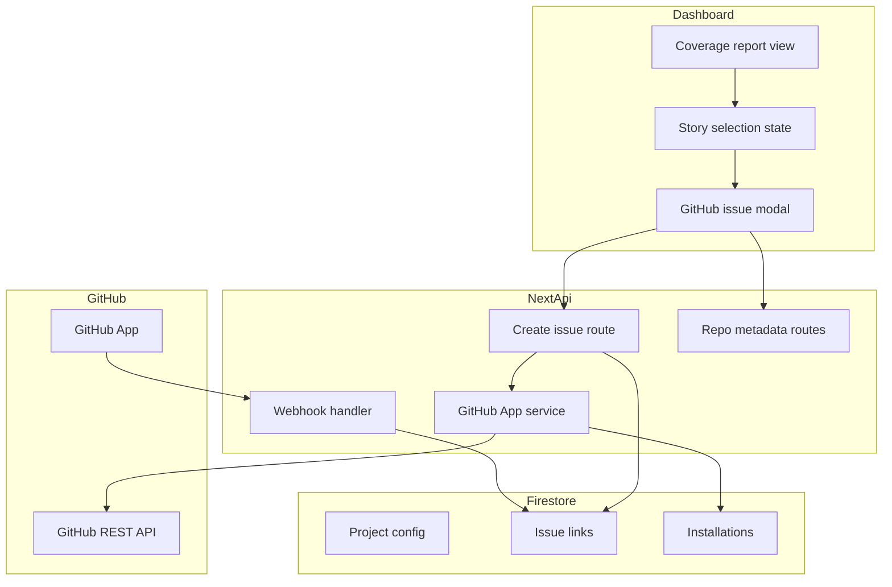
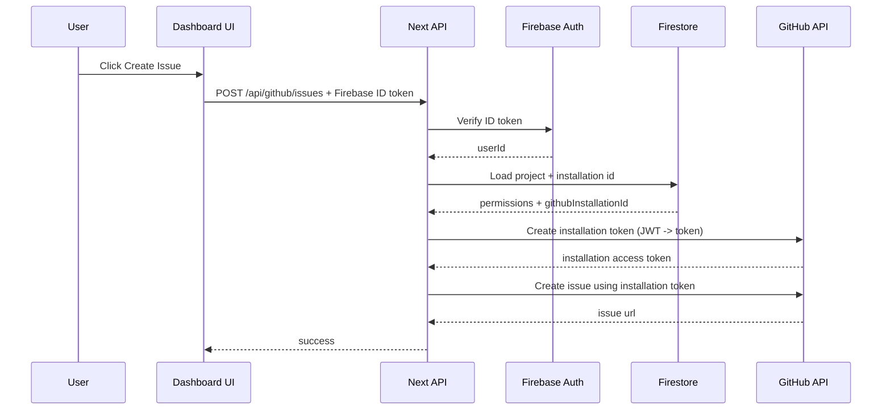

# 00 – Feature Overview: GitHub Ticketing from Coverage Failures (v2)

## Goal

Enable users to create GitHub issues directly from the coverage report by selecting individual failed stories, with full issue lifecycle automation.

**Note:** We are implementing v2 directly (GitHub App + fingerprints), skipping v1.

---

## Key v2 Features

1. **Story Fingerprints** – Stable identifiers for cross-build correlation
2. **GitHub App Integration** – Installation tokens instead of user OAuth
3. **Issue Lifecycle** – Auto-close when story passes
4. **Webhook Sync** – Keep dashboard in sync with GitHub issue state

---

## Architecture Summary



---

## Story Fingerprint Schema

```typescript
// Generated by scry-sbcov
// Format: 16 hex characters (SHA-256 truncated)
// Example: "a1b2c3d4e5f67890"

interface StoryFailure {
  storyId: string;           // "button--primary"
  fingerprint: string;       // "a1b2c3d4e5f67890"
  componentName: string;     // "Button"
  storyName: string;         // "Primary"
}
```

### Fingerprint Properties

| Property | Value |
|----------|-------|
| Length | 16 hex characters |
| Algorithm | SHA-256 of `storyFilePath::storyExportName` |
| Stability | Stable unless file path or export name changes |

---

## Subproject Responsibilities

| Subproject | Responsibility |
|------------|----------------|
| `scry-sbcov` | Generate fingerprints, capture artifacts |
| `scry-node` | Pass-through (uses scry-sbcov output) |
| `scry-developer-dashboard` | GitHub App integration, issue modal, lifecycle UI |
| `scry-cdn-service` | ❌ No changes |
| `scry-cli` | ❌ No changes |

---

## GitHub Auth Approach (v2)

Uses a **GitHub App** and **installation tokens**:

1. User installs the GitHub App into their org/repo
2. Dashboard stores `projectId -> githubInstallationId` mapping
3. For API calls, backend mints installation access token via JWT
4. Firebase Auth remains the source of truth for user identity



---

## Key UX Flow

1. User expands a component in the coverage dashboard
2. User checks specific failing stories
3. Floating button appears: "Create GitHub Issue"
4. Modal opens with pre-filled issue title/body, metadata pickers
5. Issue created; UI shows link to GitHub
6. Linked issue badge appears on the story row
7. When story passes, issue is auto-closed (based on policy)

---

## Deliverables

### Implementation Plans

- [`01-scry-developer-dashboard.md`](01-scry-developer-dashboard.md) – Dashboard plan
- [`02-scry-node.md`](02-scry-node.md) – Node plan
- [`03-scry-sbcov.md`](03-scry-sbcov.md) – sbcov plan
- [`04-github-app-and-v2.md`](04-github-app-and-v2.md) – GitHub App design
- [`05-v2-implementation-plan.md`](05-v2-implementation-plan.md) – Detailed v2 implementation

### Subproject Plans (Copied)

- [`scry-sbcov/plans/github-ticketing-feature.md`](../../scry-sbcov/plans/github-ticketing-feature.md)
- [`scry-node/plans/github-ticketing-feature.md`](../../scry-node/plans/github-ticketing-feature.md)
- [`scry-developer-dashboard/plans/github-ticketing-feature.md`](../../scry-developer-dashboard/plans/github-ticketing-feature.md)

---

## Environment Variables

```bash
# GitHub App
GITHUB_APP_ID=123456
GITHUB_APP_CLIENT_ID=Iv1.abc123def456
GITHUB_APP_CLIENT_SECRET=secret_abc123
GITHUB_APP_PRIVATE_KEY_BASE64=LS0tLS1CRUdJTi...
GITHUB_WEBHOOK_SECRET=whsec_abc123

# Feature flags
ENABLE_GITHUB_TICKETING=true
ENABLE_GITHUB_APP=true
```

---

## Implementation Phases

1. **Foundation (scry-sbcov)** – Fingerprint generation, type changes
2. **GitHub App Setup** – Create app, store credentials
3. **Dashboard Backend** – API routes for issues, webhooks, installation
4. **Dashboard Frontend** – Issue modal, story selection, linked issue indicators
5. **Issue Lifecycle** – Auto-close when story passes
6. **Testing** – Unit, integration, E2E tests
