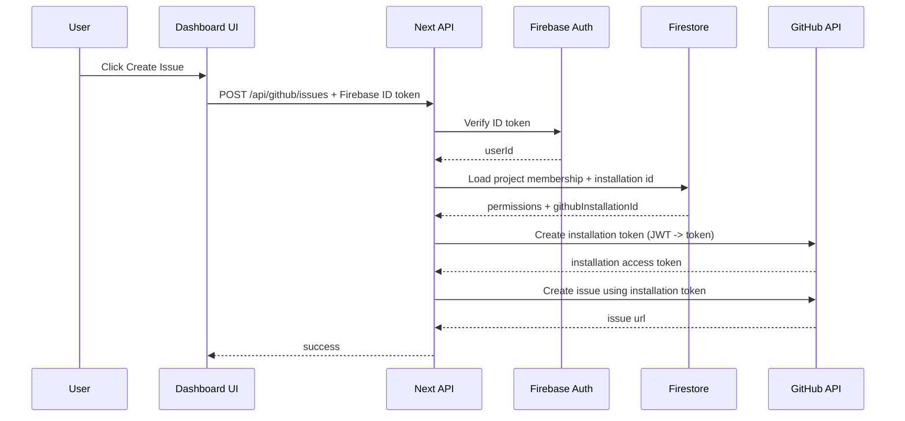

# 04 – GitHub App + Full v2 Implementation Plan

This document describes the plan to migrate from **v1 OAuth-user-token** integration to a **GitHub App** and deliver the **full v2 automation features**.

---

## Why a GitHub App for v2

v2 requires capabilities that are hard or brittle with end-user OAuth tokens:
- server-to-server automation (auto-close issues when story passes)
- webhook-driven sync (issue created/closed/edited)
- org-friendly installs and least-privilege permissions
- avoids requiring every user to grant broad `repo` scope

---

## GitHub App Design

### Permissions (least privilege)

**Repository permissions**
- Issues: Read & Write (create/close/edit)
- Metadata: Read (labels, milestones)
- Contents: Read (optional; only if we want to link to repo files via API)

**Organization permissions**
- Members: Read (optional; only if we want richer assignee UX)

**Events / Webhooks**
- Issues (opened/edited/closed)
- Issue comment (optional)
- Pull request (optional; useful for PR linking)
- Installation (created/deleted)

### Auth model

1. User installs the GitHub App into an org/repo
2. We store installation metadata per project
3. For API calls, backend obtains an **installation access token** via GitHub App JWT
4. Dashboard calls our API; our API calls GitHub

---

## How the GitHub App Interacts with Firebase Auth

### Principle: Firebase Auth authenticates *users*, GitHub App authenticates *the installation*

- **Firebase Auth** answers: *Who is making this request?* (user identity + permissions)
- **GitHub App** answers: *Which GitHub installation / repo should we act on?* (repo-scoped access)

In v2, the user does **not** provide a GitHub OAuth token. Instead:

1. The user signs into the dashboard via Firebase Auth.
2. The user triggers a GitHub App install/connect flow.
3. We persist `projectId -> githubInstallationId`.
4. For any GitHub operation, our backend verifies Firebase user permissions, then uses the installation token.

### Request flow (v2)

### Authorization rules (enforced by our API)

We must enforce **project-level permissions** before using GitHub installation credentials.

Suggested checks:
- User is a member of the project
- Role is `owner` or `admin` (or a new permission flag like `canCreateIssues`)

### Installation linking flow (recommended)

1. UI calls `GET /api/github-app/install-url?projectId=...`
2. API verifies Firebase user has admin/owner access to project
3. API returns GitHub App install URL (with `state`)
4. User completes install on GitHub
5. GitHub redirects back to `GET /api/github-app/callback?code=...&state=...`
6. API validates `state`, extracts `installation_id`, stores mapping in Firestore

### Webhooks + Firebase

Webhooks are **not** authenticated with Firebase (they come from GitHub), so:
- Verify GitHub webhook signature
- Look up installation id -> project mapping
- Update Firestore linkage tables (issue state, etc.)

---

## Which Services Need to Change for GitHub App + Full v2

### Required changes

#### 1) `scry-developer-dashboard`
This remains the primary execution surface.

**Why:**
- Hosts the Next.js API routes where we can implement GitHub App auth (JWT → installation token)
- Owns the UI for install/connect, and for issue creation from coverage

**What changes:**
- Add install/connect UI in [`ProjectSettings.tsx`](scry-developer-dashboard/components/project-detail/ProjectSettings.tsx)
- Add GitHub App callback + webhook routes under `app/api/...`
- Update existing GitHub issue routes to use installation tokens instead of user OAuth tokens
- Add Firestore persistence for `projectId -> installationId` and `storyFingerprint -> issue` mappings

#### 2) `scry-node`
**Why:**
- v2 automation depends on stable story identity and pass/fail transitions across builds

**What changes:**
- Emit stable story fingerprints
- Emit or compute transitions (failing→passing) so the dashboard can trigger auto-close policies

### Optional changes

#### 3) `scry-sbcov`
**Why:**
- Provides failure artifacts (screenshots/logs) for auto-attachments

**What changes:**
- Capture artifacts and publish URLs into the coverage JSON

### No changes
- `scry-cdn-service`
- `scry-cli`

---

## Do We Need a Separate Service for the GitHub App?

### v2 recommendation (pragmatic)
**No separate service is strictly required initially.**

We can implement the GitHub App integration inside the dashboard’s Next.js backend (API routes) because:
- It already has authenticated users (Firebase)
- It already talks to Firestore
- It already owns the coverage UI that triggers GitHub actions
- It reduces operational overhead (no new deploy pipeline)

This is the “monolith-first” approach:
- UI + API routes + Firestore mappings all in `scry-developer-dashboard`

### When a separate service becomes beneficial
Consider extracting a dedicated “GitHub integration service” if any of these become true:

1. **High webhook volume / background work**
   - Webhooks + auto-close tasks require queues/workers

2. **Multi-product reuse**
   - If other apps need GitHub App operations beyond the dashboard

3. **Security boundary / secret management**
   - Centralize GitHub App private key handling behind a narrower surface

4. **Reliability/SLOs**
   - Avoid coupling GitHub automation uptime to the dashboard deploy cycle

### If we do create a separate service
The shape would be:
- A webhook receiver + token minter + GitHub API proxy
- Authenticated by service-to-service auth (and still gated by Firebase/Firestore permissions via the dashboard)

But this is a later optimization; it should not block v2 planning.

---

## Cross-service v2 Feature Set

### v2.1 – Installation + Tokenization
**Goal:** enable GitHub API access without user tokens.

### v2.2 – Issue lifecycle linking
**Goal:** store links between stories and created issues.

### v2.3 – Auto-close / Auto-update
**Goal:** when a story starts passing, auto-close (or comment) on linked issues.

### v2.4 – Artifact automation
**Goal:** automatically attach screenshots/logs generated by sbcov.

---

# Subproject Plans

## A) scry-developer-dashboard (v2)

### New UI flows

1. **Project Settings → GitHub App connect**
- Show install status
- Button: "Install GitHub App"
- Button: "Manage installation"

2. **Issue modal**
- No longer needs end-user GitHub token
- Metadata loading + issue creation done via our API using installation token

3. **Coverage dashboard indicators**
- Show linked issue for each failing story
- Show issue state (open/closed)
- Optional: “Auto-close enabled” badge

### File changes (expected)
- Modify [`ProjectSettings.tsx`](scry-developer-dashboard/components/project-detail/ProjectSettings.tsx)
  - GitHub App install/connect UI
- Modify coverage UI files
  - show linked issues per story
- Modify API calls
  - stop using `localStorage` GitHub token for v2 paths

---

## B) scry-node (v2)

### Purpose
Enable cross-build correlation and emit story lifecycle transitions.

### Changes
- Add stable `storyFingerprint` to each story
- Persist story outcomes per build
- Compute transitions:
  - failing → passing
  - passing → failing

### Outputs
- Coverage report includes story fingerprints
- Optional: emit an internal event payload used by dashboard automation

---

## C) scry-sbcov (v2 optional)

### Purpose
Generate failure artifacts so issues can include screenshots/logs automatically.

### Changes
- Capture screenshot per failing story
- Capture console logs
- Upload artifacts to storage
- Add artifact URLs into coverage JSON

---

## D) Backend/API surface (where to implement)

**Note:** In this repo, we can start by implementing GitHub App logic inside Next.js API routes in `scry-developer-dashboard` (simplest).

If we later want a dedicated service, we can extract to a standalone backend.

### New API routes (expected)
- `POST /api/github-app/installations` (persist installation mapping)
- `POST /api/github-app/webhooks` (GitHub webhook receiver)
- `POST /api/github/issues` (create issue via installation token)
- `POST /api/github/issues/:id/close` (auto-close)
- `GET /api/github/issues?storyFingerprint=...` (fetch linked)

### Data model additions
We need to store:
- project → GitHub installation id
- storyFingerprint → issue id(s)
- issue state cache (optional)

Where to store:
- Firestore is the likely place (already used across products)

---

# Webhook Handling

### Verify signatures
- Use GitHub webhook secret
- Reject unsigned/invalid payloads

### Events
- On issue closed: update our mapping cache
- On issue reopened: update cache
- On installation removed: disable GitHub features for project

---

# Auto-close Design

Policy options:
1. Close immediately when story passes
2. Require N passing builds
3. Comment + label instead of close

Recommended default:
- comment + add label `fixed-in-build` on first pass
- close after 2 consecutive passing builds

---

# Attachments in v2

### Sources
- Manual uploads (still supported)
- Auto artifacts from `scry-sbcov`

### Embedding
- Always embed URLs in issue body
- Optional: add comment containing artifacts when created post-issue

---

# Acceptance Criteria (v2)

1. Project can connect a GitHub repo via App installation.
2. Issues can be created without end-user tokens.
3. Created issues are linked to story fingerprints.
4. When failures resolve, linked issues are auto-closed or updated based on policy.
5. Webhooks keep issue state in sync.
6. Artifacts can be auto-attached when available.
