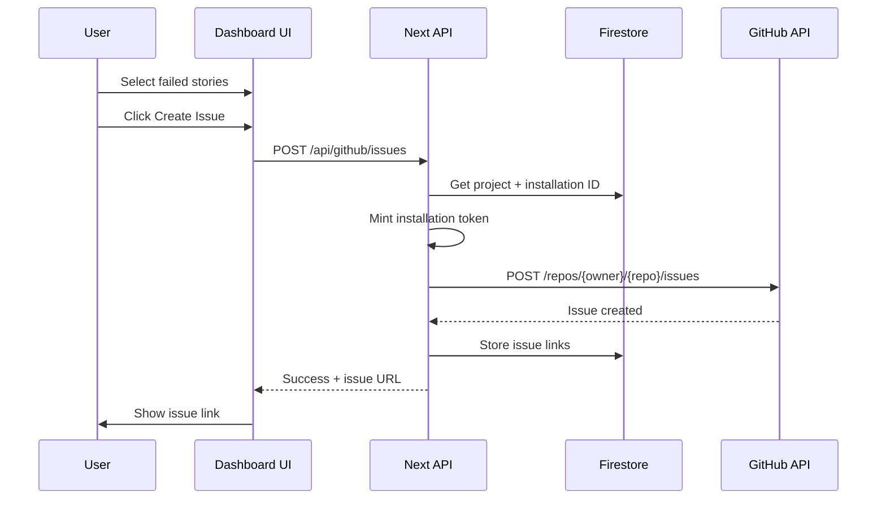
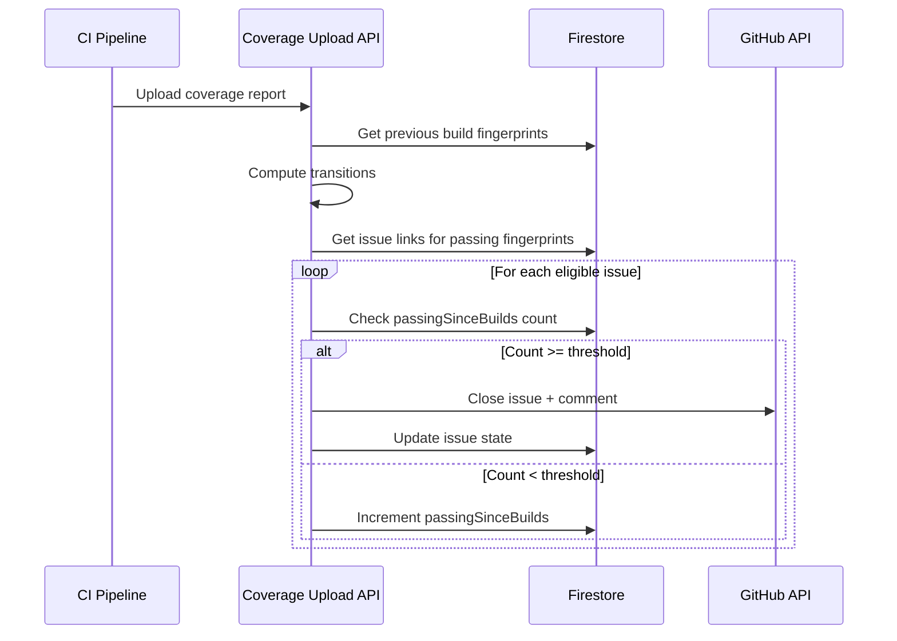

# 05 – v2 Implementation Plan (GitHub App + Story Fingerprints)

This document provides the detailed implementation plan for jumping directly to v2, skipping v1's OAuth-user-token approach.

---

## Executive Summary

v2 delivers:
1. **GitHub App integration** – installation tokens instead of user OAuth
2. **Story fingerprints** – stable identifiers for cross-build correlation
3. **Issue lifecycle automation** – auto-close when story passes
4. **Webhook-driven sync** – keep dashboard in sync with GitHub issue state

---

## 1. Story Fingerprint Design

### Problem
The existing `storyId` (e.g., `"button--primary"`) is derived from Storybook's internal ID generation and may not be stable across:
- Story file renames
- Component renames
- Storybook version upgrades

### Solution: Stable Fingerprint

Generate a fingerprint from inputs that are unlikely to change:

```typescript
// scry-sbcov/src/utils/fingerprint.ts

import { createHash } from 'crypto';

export interface FingerprintInputs {
  /** Relative path to story file from project root */
  storyFilePath: string;
  /** Story export name (e.g., "Primary", "Loading") */
  storyExportName: string;
  /** Component name (optional, for disambiguation) */
  componentName?: string;
}

/**
 * Generate a stable fingerprint for a story.
 * 
 * The fingerprint is a SHA-256 hash (truncated to 16 chars) of:
 *   storyFilePath + "::" + storyExportName
 * 
 * This is stable across:
 * - Storybook version upgrades
 * - Build environment changes
 * - Story ordering changes
 * 
 * It will change if:
 * - Story file is moved/renamed
 * - Story export is renamed
 */
export function generateStoryFingerprint(inputs: FingerprintInputs): string {
  const { storyFilePath, storyExportName, componentName } = inputs;
  
  // Normalize path separators
  const normalizedPath = storyFilePath.replace(/\\/g, '/');
  
  // Build canonical string
  const canonical = componentName
    ? `${normalizedPath}::${componentName}::${storyExportName}`
    : `${normalizedPath}::${storyExportName}`;
  
  // Hash and truncate
  const hash = createHash('sha256').update(canonical).digest('hex');
  return hash.substring(0, 16);
}
```

### Fingerprint Properties

| Property | Value |
|----------|-------|
| Length | 16 hex characters |
| Collision probability | ~1 in 18 quintillion (for 16 chars) |
| Stability | Stable unless file path or export name changes |
| Human-readable | No (use storyId for display) |

### Where Fingerprints Are Generated

**scry-sbcov** generates fingerprints during story execution:
- File: `scry-sbcov/src/core/story-executor.ts`
- Add `fingerprint` field to `StoryExecutionResult` and `StoryFailure`

---

## 2. Type Changes

### scry-sbcov/src/types/index.ts

```typescript
// Add to StoryExecutionResult (line ~246)
export interface StoryExecutionResult {
  /** Story ID (e.g., "button--primary") */
  storyId: string;
  
  /** Stable fingerprint for cross-build correlation (v2) */
  fingerprint: string;
  
  // ... existing fields
}

// Add to StoryFailure (line ~281)
export interface StoryFailure {
  /** Story ID */
  storyId: string;
  
  /** Stable fingerprint for cross-build correlation (v2) */
  fingerprint: string;
  
  // ... existing fields
}
```

### scry-developer-dashboard/lib/types/project.types.ts

```typescript
// Add repository configuration to Project
export interface Project {
  // ... existing fields
  
  /** GitHub repository configuration (v2) */
  repository?: RepositoryConfig;
  
  /** GitHub App installation ID (v2) */
  githubInstallationId?: number;
}

export interface RepositoryConfig {
  provider: 'github';
  owner: string;
  repo: string;
  url: string;
}
```

---

## 3. Firestore Schema (v2)

### Collections

#### `projects/{projectId}` (existing, extended)

```typescript
{
  // ... existing fields
  
  // v2 additions
  repository: {
    provider: 'github',
    owner: 'acme-corp',
    repo: 'design-system',
    url: 'https://github.com/acme-corp/design-system'
  },
  githubInstallationId: 12345678,
  githubAppConnectedAt: Timestamp,
  githubAppConnectedBy: 'user-id'
}
```

#### `projects/{projectId}/issueLinks/{fingerprint}` (new)

Maps story fingerprints to GitHub issues.

```typescript
{
  fingerprint: 'a1b2c3d4e5f67890',
  storyId: 'button--primary',
  componentName: 'Button',
  storyName: 'Primary',
  
  // GitHub issue reference
  issueNumber: 42,
  issueUrl: 'https://github.com/acme-corp/design-system/issues/42',
  issueState: 'open' | 'closed',
  
  // Lifecycle tracking
  createdAt: Timestamp,
  createdBy: 'user-id',
  lastSyncedAt: Timestamp,
  
  // Auto-close tracking
  passingSinceBuilds: ['build-id-1', 'build-id-2'],
  autoCloseEligible: boolean
}
```

#### `projects/{projectId}/issueDefaults` (new, optional)

Project-level defaults for issue creation.

```typescript
{
  defaultLabels: ['storybook', 'visual-regression'],
  defaultAssignees: ['github-username'],
  defaultMilestone: 'v2.0',
  issueTemplate: '## Story Failure\n\n{{storyDetails}}\n\n## Steps to Reproduce\n...',
  autoClosePolicy: {
    enabled: true,
    requiredPassingBuilds: 2,
    action: 'close' | 'comment' | 'label'
  }
}
```

#### `githubAppInstallations/{installationId}` (new, global)

Tracks GitHub App installations across all projects.

```typescript
{
  installationId: 12345678,
  accountType: 'Organization' | 'User',
  accountLogin: 'acme-corp',
  accountId: 98765432,
  
  // Which projects use this installation
  projectIds: ['project-id-1', 'project-id-2'],
  
  // Lifecycle
  installedAt: Timestamp,
  installedBy: 'user-id',
  
  // Permissions granted
  permissions: {
    issues: 'write',
    metadata: 'read'
  },
  
  // Events subscribed
  events: ['issues', 'installation']
}
```

---

## 4. Environment Variables

### GitHub App Configuration

```bash
# GitHub App identity
GITHUB_APP_ID=123456
GITHUB_APP_CLIENT_ID=Iv1.abc123def456
GITHUB_APP_CLIENT_SECRET=secret_abc123

# GitHub App private key (PEM format, base64 encoded for env var)
GITHUB_APP_PRIVATE_KEY_BASE64=LS0tLS1CRUdJTi...

# Webhook secret for signature verification
GITHUB_WEBHOOK_SECRET=whsec_abc123

# App URLs
GITHUB_APP_INSTALL_URL=https://github.com/apps/scry-storybook/installations/new
GITHUB_APP_CALLBACK_URL=https://dashboard.scry.dev/api/github-app/callback
```

### Dashboard Configuration

```bash
# Feature flags
ENABLE_GITHUB_TICKETING=true
ENABLE_GITHUB_APP=true

# Auto-close defaults
GITHUB_AUTO_CLOSE_REQUIRED_BUILDS=2
```

---

## 5. Implementation Checklist

### Phase 1: Foundation (scry-sbcov)

- [ ] Create `scry-sbcov/src/utils/fingerprint.ts`
- [ ] Add `fingerprint` field to `StoryExecutionResult` type
- [ ] Add `fingerprint` field to `StoryFailure` type
- [ ] Modify `story-executor.ts` to generate fingerprints during execution
- [ ] Add fingerprints to coverage report output
- [ ] Add unit tests for fingerprint generation
- [ ] Publish new scry-sbcov version

### Phase 2: GitHub App Setup

- [ ] Create GitHub App in GitHub Developer Settings
  - Name: `Scry Storybook`
  - Permissions: Issues (R/W), Metadata (R)
  - Events: issues, installation
  - Callback URL: `https://dashboard.scry.dev/api/github-app/callback`
  - Webhook URL: `https://dashboard.scry.dev/api/github-app/webhook`
- [ ] Store App credentials in environment
- [ ] Document App setup in README

### Phase 3: Dashboard Backend (API Routes)

- [ ] Create `lib/services/github-app.service.ts`
  - JWT generation from private key
  - Installation token minting
  - Token caching (10 min TTL)
- [ ] Create `app/api/github-app/install-url/route.ts`
  - Generate install URL with state parameter
  - State includes projectId + userId + nonce
- [ ] Create `app/api/github-app/callback/route.ts`
  - Validate state parameter
  - Store installation mapping in Firestore
- [ ] Create `app/api/github-app/webhook/route.ts`
  - Verify webhook signature
  - Handle `issues` events (sync state)
  - Handle `installation` events (lifecycle)
- [ ] Create `app/api/github/issues/route.ts`
  - Create issue using installation token
  - Store issue link in Firestore
- [ ] Create `app/api/github/repos/[owner]/[repo]/labels/route.ts`
- [ ] Create `app/api/github/repos/[owner]/[repo]/milestones/route.ts`
- [ ] Create `app/api/github/repos/[owner]/[repo]/collaborators/route.ts`

### Phase 4: Dashboard Frontend (UI)

- [ ] Extend `ProjectSettings.tsx`
  - Repository configuration section
  - GitHub App install/connect button
  - Installation status display
- [ ] Create `components/coverage/GitHubIssueModal.tsx`
  - Title/body editing
  - Labels/milestone/assignees pickers
  - Attachments section
  - Create button
- [ ] Modify `CoverageDashboard.tsx`
  - Expandable component rows
  - Story selection checkboxes
  - Floating "Create Issue" button
  - Show linked issue indicators
- [ ] Create `components/coverage/FailedStoryRow.tsx`
  - Checkbox for selection
  - Error snippet display
  - Linked issue badge

### Phase 5: Issue Lifecycle (Auto-close)

- [ ] Extend coverage upload API to detect transitions
  - Compare fingerprints between builds
  - Identify failing→passing transitions
- [ ] Create auto-close worker/handler
  - Check `passingSinceBuilds` count
  - Apply auto-close policy
  - Close or comment on issue
- [ ] Add lifecycle indicators to UI
  - "Fixed in build X" badge
  - "Auto-close pending" indicator

### Phase 6: Testing

- [ ] Unit tests for fingerprint generation
- [ ] Unit tests for GitHub App JWT/token minting
- [ ] Integration tests for API routes (mock GitHub)
- [ ] E2E test for issue creation flow
- [ ] E2E test for webhook handling

---

## 6. API Route Specifications

### POST /api/github/issues

Create a GitHub issue for selected story failures.

**Request:**
```typescript
{
  projectId: string;
  title: string;
  body: string;
  labels?: string[];
  milestone?: number;
  assignees?: string[];
  storyFingerprints: string[];  // Link these stories to the issue
}
```

**Response:**
```typescript
{
  issueNumber: number;
  issueUrl: string;
  linkedFingerprints: string[];
}
```

### GET /api/github-app/install-url

Get the GitHub App installation URL.

**Query:**
```
?projectId=xxx
```

**Response:**
```typescript
{
  installUrl: string;  // Includes state parameter
}
```

### POST /api/github-app/webhook

GitHub webhook receiver.

**Headers:**
```
X-Hub-Signature-256: sha256=...
X-GitHub-Event: issues | installation
```

**Body:** GitHub webhook payload

---

## 7. Sequence Diagrams

### Issue Creation Flow



### Auto-close Flow



---

## 8. Migration Notes

### From v1 (if any v1 work was done)

If any v1 OAuth-based implementation exists:
1. Keep OAuth for user identity (Firebase GitHub provider)
2. Remove `repo` scope requirement
3. Migrate any stored user tokens to installation tokens

### Data Migration

No data migration required for new v2 implementation. The `issueLinks` collection is new.

---

## 9. Rollout Plan

### Stage 1: Internal Testing
- Deploy to staging environment
- Test with internal projects
- Validate fingerprint stability across builds

### Stage 2: Beta
- Enable for select beta users
- Gather feedback on UX
- Monitor webhook reliability

### Stage 3: GA
- Enable for all users
- Document in user guide
- Add to onboarding flow

---

## 10. Risks and Mitigations

| Risk | Impact | Mitigation |
|------|--------|------------|
| Fingerprint instability | Issues linked to wrong stories | Use conservative inputs (file path + export name only) |
| GitHub App rate limits | API failures | Cache installation tokens, batch requests |
| Webhook delivery failures | Stale issue state | Periodic sync job, manual refresh button |
| Private key exposure | Security breach | Store in secret manager, rotate regularly |
| User confusion (no OAuth) | Support burden | Clear onboarding, help tooltips |
