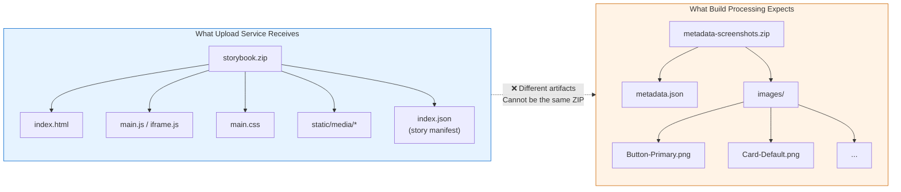
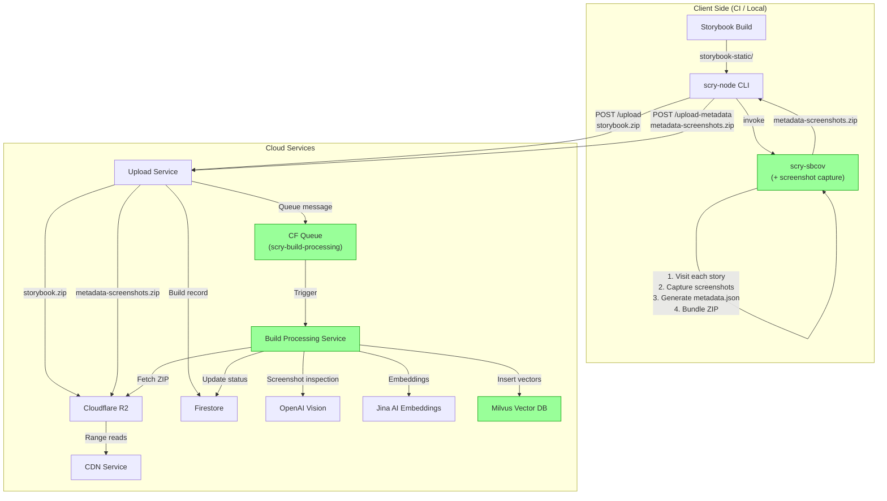
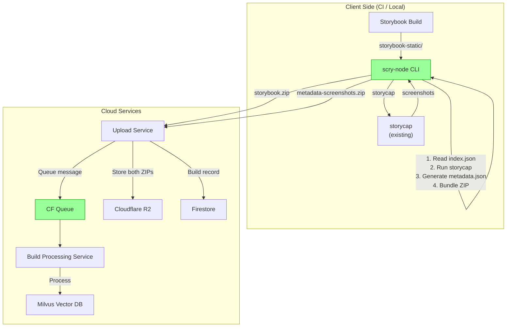
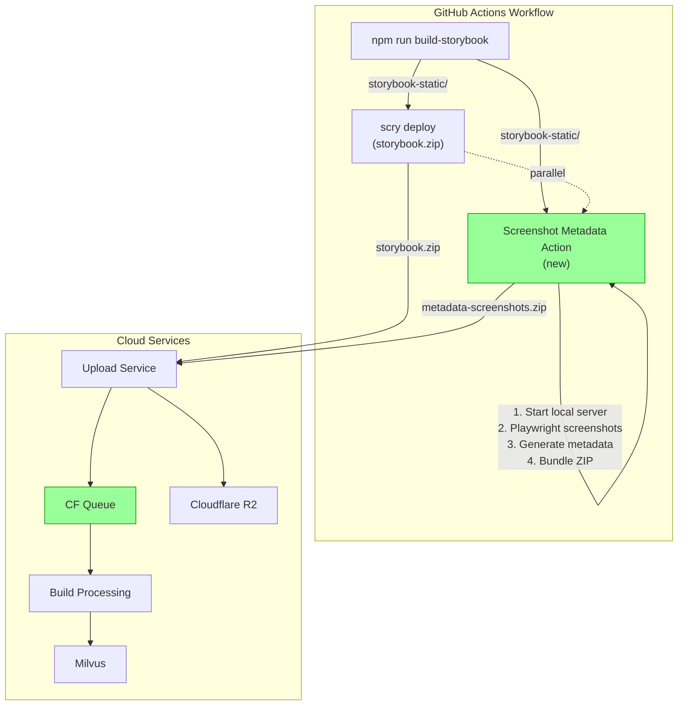
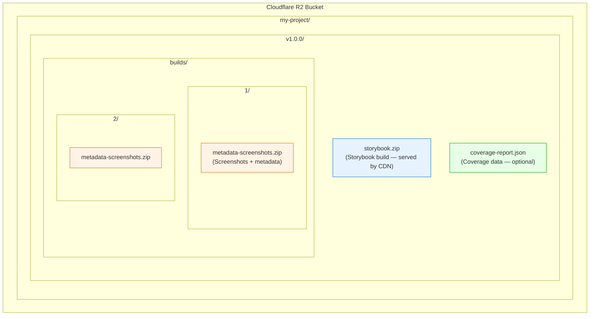
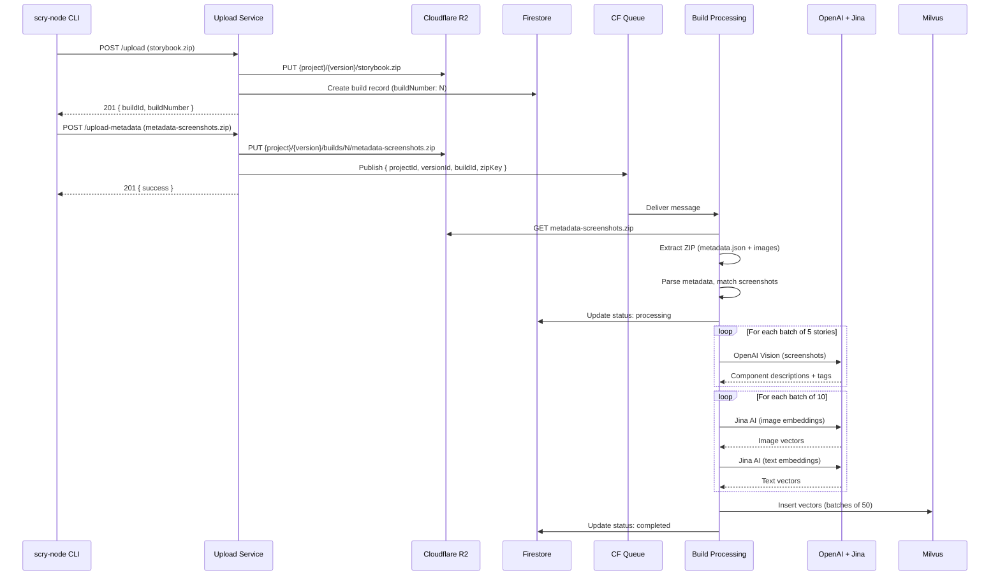
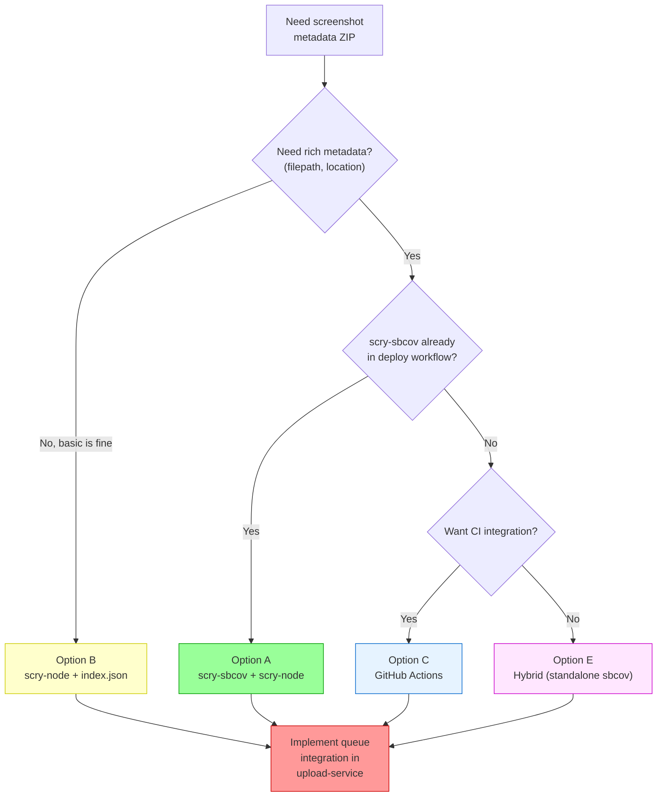
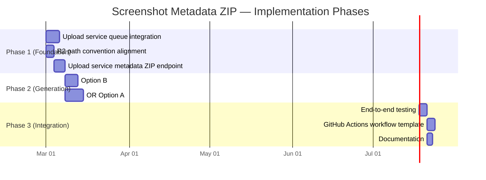

# Screenshot Metadata ZIP — Architecture Diagrams

This document contains Mermaid diagrams illustrating the current state, gaps, and proposed solutions.

---

## 1. Current State — Data Flow

**Legend:** Red nodes indicate broken/disconnected parts of the pipeline.

---

## 2. Current State — ZIP Contents Comparison

---

## 3. Proposed Flow — Option A (scry-sbcov + scry-node)

---

## 4. Proposed Flow — Option B (scry-node with index.json)

---

## 5. Proposed Flow — Option C (GitHub Actions)

---

## 6. R2 Storage Layout — Proposed

---

## 7. Queue Message Flow — Sequence Diagram

---

## 8. Decision Tree — Which Option to Choose

---

## 9. Implementation Phases

