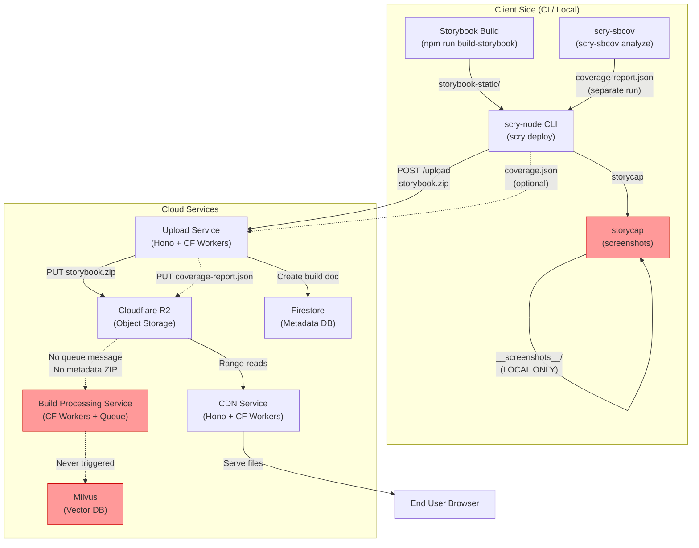
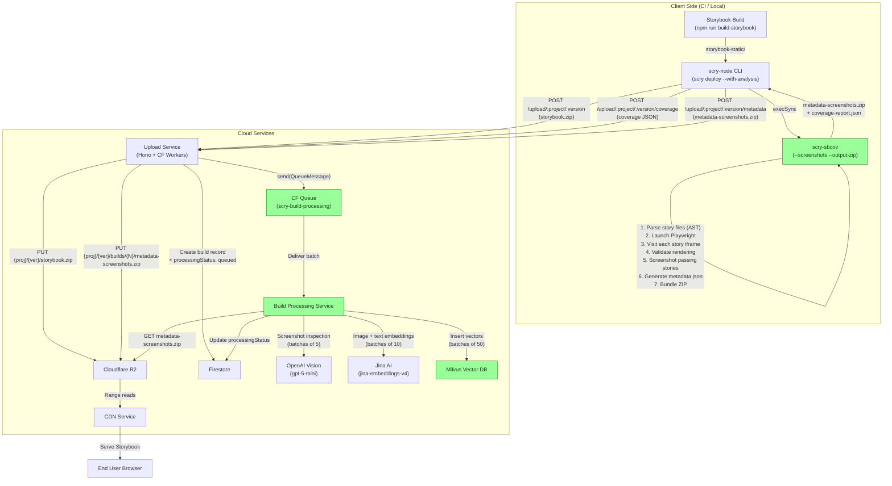
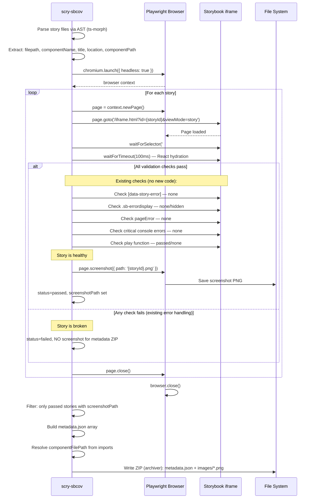
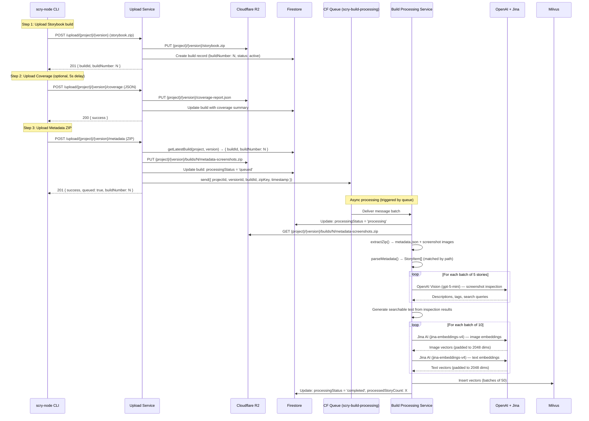
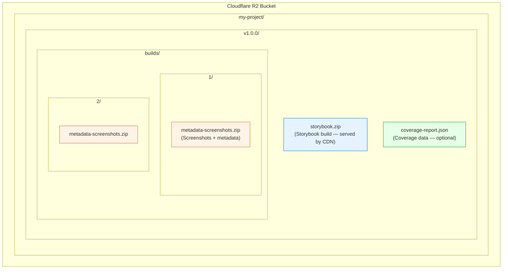
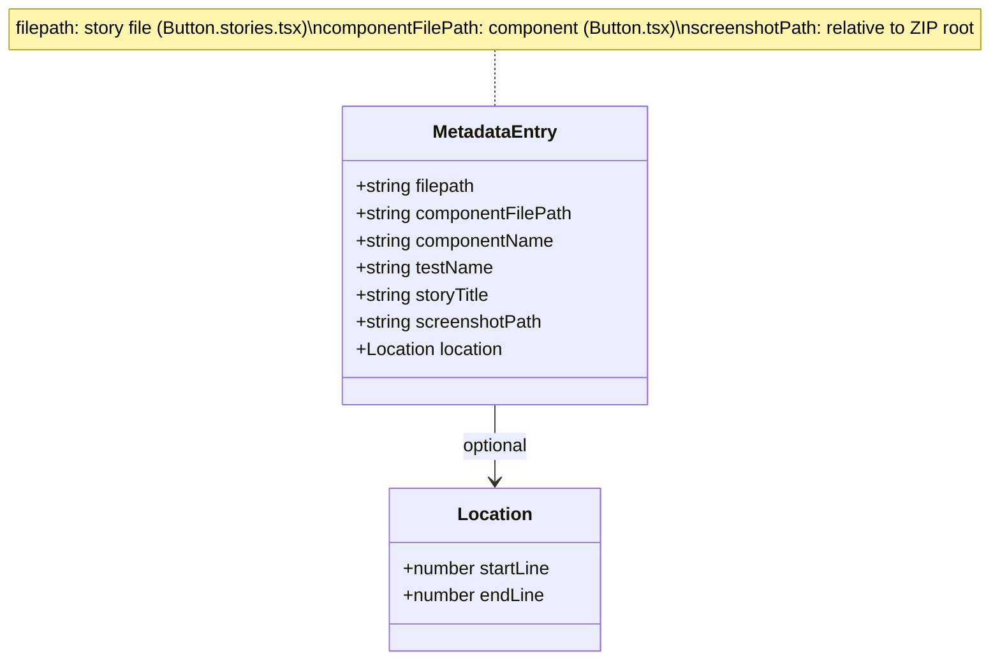
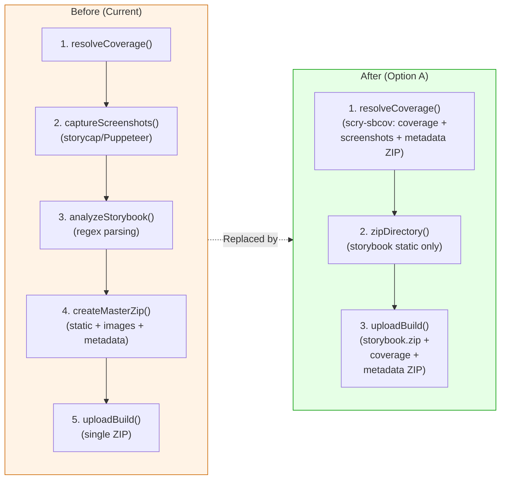
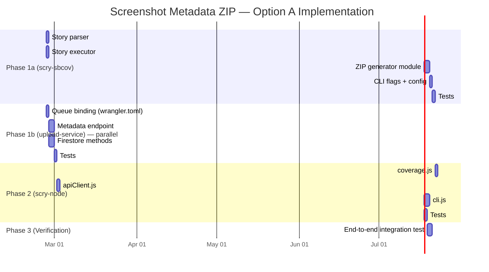

# Screenshot Metadata ZIP — Architecture Diagrams

This document contains Mermaid diagrams illustrating the current state, the selected implementation (Option A), and implementation details.

---

## 1. Current State — Data Flow

**Legend:** Red nodes indicate broken/disconnected parts of the pipeline.

---

## 2. Current State — ZIP Contents Comparison

---

## 3. Implemented Flow — Option A (scry-sbcov + scry-node)

---

## 4. Story Execution & Screenshot Sequence

---

## 5. Upload & Queue Sequence

---

## 6. R2 Storage Layout

---

## 7. metadata.json Schema

---

## 8. Deploy Flow Comparison

---

## 9. Implementation Phases

