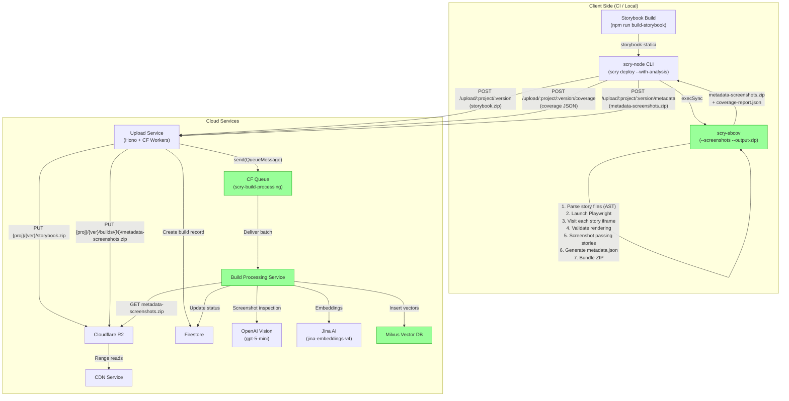
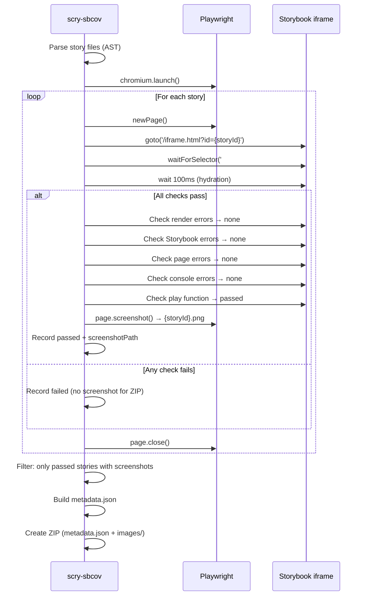
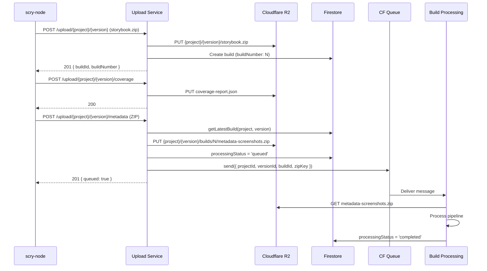

# Screenshot Metadata ZIP — Implementation Plan (Option A)

**Issue:** #27
**Date:** 2026-02-25
**Status:** Option A selected, implementation ready
**Decision:** scry-sbcov generates metadata+screenshots ZIP, scry-node uploads, upload-service enqueues processing

---

## Summary

The `scry-build-processing-service` has a fully implemented and tested pipeline (44 tests pass) that processes screenshot+metadata ZIPs through OpenAI Vision → Jina embeddings → Milvus vectors. However, **nothing feeds it** — no service generates the expected ZIP format, and no service publishes queue messages to trigger processing.

This plan implements Option A: scry-sbcov generates the ZIP during story execution (leveraging its existing Playwright browser session and AST-based metadata), scry-node orchestrates the flow and uploads artifacts, and the upload-service stores the ZIP and enqueues processing.

---

## Design Decisions

### 1. Option A over Option B
**Why scry-sbcov over scry-node's index.json approach?**
- scry-sbcov already visits every story individually via Playwright with full error checking
- scry-sbcov has the richest metadata from AST parsing: `filepath`, `componentName`, `location` (line numbers)
- scry-node's storycap approach is already planned for deprecation (see story-capture-feature plan)
- Single browser session for both coverage analysis and screenshot capture — no duplicate work

### 2. Replace storycap flow entirely
**When `--with-analysis` is used, scry-sbcov replaces storycap + analyzeStorybook().**
- The existing flow ran storycap (Puppeteer) AND scry-sbcov (Playwright) — two separate browser sessions visiting the same stories
- Option A consolidates to a single scry-sbcov invocation that handles coverage, screenshots, and metadata in one pass
- The simple deploy path (without `--with-analysis`) stays unchanged

### 3. Only screenshot passing stories
**Broken stories are excluded from the metadata ZIP entirely.**
- scry-sbcov already validates each story: checks for render errors, Storybook errors, page errors, console errors, and play function failures
- Screenshots are captured ONLY after all validation passes (on the success path)
- If any check fails, the story gets `status: 'failed'` and no screenshot is captured
- The ZIP generator filters: only `status === 'passed'` stories with a `screenshotPath` are included
- This prevents broken/errored components from polluting the search index

### 4. Require existing build record
**Metadata ZIP upload requires a storybook ZIP to be uploaded first.**
- The upload-service's `/metadata` endpoint looks up the latest build record for the project+version
- If no build exists, it returns 400
- This enforces correct ordering: storybook.zip → coverage → metadata ZIP
- The build record provides `buildId` and `buildNumber` needed for the queue message and R2 path

### 5. New metadata fields
**Added `location` and `componentFilePath` beyond what build-processing requires.**
- `location: { startLine, endLine }` — AST line numbers from ts-morph. Easy to add (~5 lines) since the AST is already being traversed. Enriches search results with source code references.
- `componentFilePath` — the actual component file (e.g., `Button.tsx`) resolved from the story file's import. scry-sbcov already extracts `componentPath` from imports; we just resolve it to a full path.
- Build-processing treats both as optional (ignores unknown fields). No changes needed on the consumer side now, but data is available for future use.

### 6. Queue binding is optional
**Upload-service works with or without the queue binding.**
- `BUILD_PROCESSING_QUEUE` is typed as optional (`Queue?`) in Bindings
- If the queue isn't configured (e.g., dev/staging without queue), the metadata endpoint still stores the ZIP but returns `queued: false`
- This prevents deployment failures in environments without the queue

---

## Architecture

### Data Flow



### Story Execution & Screenshot Sequence



### Upload & Queue Sequence



### R2 Storage Layout

```
{project}/{version}/
├── storybook.zip                              # Storybook build (served by CDN)
├── coverage-report.json                       # Coverage data (optional)
└── builds/
    ├── 1/
    │   └── metadata-screenshots.zip           # Build 1 screenshots + metadata
    └── 2/
        └── metadata-screenshots.zip           # Build 2 screenshots + metadata
```

---

## Metadata Format

### metadata.json schema

```json
[
  {
    "filepath": "src/components/Button.stories.tsx",
    "componentFilePath": "src/components/Button.tsx",
    "componentName": "Button",
    "testName": "Primary",
    "storyTitle": "Components/Button",
    "screenshotPath": "images/button--primary.png",
    "location": { "startLine": 15, "endLine": 22 }
  }
]
```

### Field mapping

| Field | Source in scry-sbcov | Notes |
|---|---|---|
| `filepath` | `ParsedStoryFile.relativePath` | Story file path |
| `componentFilePath` | Resolved from `meta.componentPath` | Component file path (new) |
| `componentName` | `ParsedStoryFile.meta.componentName` | Falls back to `'Unknown'` |
| `testName` | `ParsedStory.storyName` | e.g., "Primary", "With Icon" |
| `storyTitle` | `ParsedStoryFile.meta.title` | e.g., "Components/Button" |
| `screenshotPath` | `images/${storyId}.png` | Relative to ZIP root |
| `location` | AST node line numbers | New — from ts-morph |

### ZIP structure

```
metadata-screenshots.zip
├── metadata.json
└── images/
    ├── button--primary.png
    ├── button--secondary.png
    └── card--default.png
```

---

## Implementation Order

| Phase | Service | Dependencies | Can parallelize? |
|-------|---------|-------------|-----------------|
| 1a | scry-sbcov | None | Yes (with 1b) |
| 1b | upload-service | None | Yes (with 1a) |
| 2 | scry-node | Needs 1a + 1b | No |
| 3 | End-to-end test | Needs all | No |

---

## Per-Service Plans

| File | Service | Description |
|------|---------|-------------|
| [05-impl-scry-sbcov.md](./05-impl-scry-sbcov.md) | scry-sbcov | Screenshot capture, ZIP generation, location tracking |
| [06-impl-upload-service.md](./06-impl-upload-service.md) | upload-service | Queue binding, metadata endpoint, Firestore methods |
| [07-impl-scry-node.md](./07-impl-scry-node.md) | scry-node | Replace storycap flow, upload metadata ZIP |

**scry-build-processing-service** requires no code changes. See compatibility verification in [05-impl-scry-sbcov.md](./05-impl-scry-sbcov.md).

---

## Verification Plan

### Unit tests
```bash
cd scry-sbcov && npm test
cd scry-storybook-upload-service && npm test
cd scry-node && npm test
```

### Integration test
1. Build sample Storybook
2. Run scry-sbcov with `--screenshots --output-zip`
3. Verify ZIP contents (metadata.json + images)
4. Upload storybook → coverage → metadata ZIP
5. Verify queue message and Firestore status
6. Verify build-processing processes successfully
