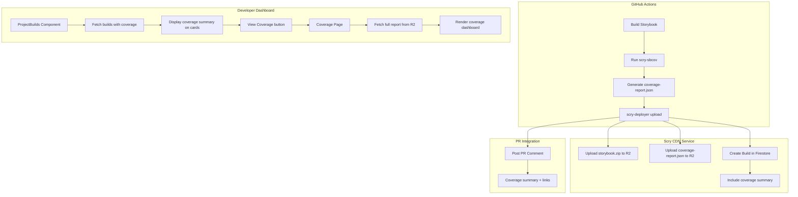

# Scry Storybook Coverage Integration Plan

> **Implementation Specs:** See individual project specs in this directory:
> - [01-scry-developer-dashboard-spec.md](./scry-sbcov-integration/01-scry-developer-dashboard-spec.md) - Dashboard UI and API changes
> - [02-scry-node-spec.md](./scry-sbcov-integration/02-scry-node-spec.md) - CLI and GitHub Actions integration
> - [03-scry-storybook-upload-service-spec.md](./scry-sbcov-integration/03-scry-storybook-upload-service-spec.md) - Upload service changes
> - [04-scry-cdn-service-spec.md](./scry-sbcov-integration/04-scry-cdn-service-spec.md) - CDN service changes

> **Private Projects (Option 1) Specs:**
> - [Private Projects PRD](./private-projects/00-private-projects-prd.md)
> - [Dashboard Private Projects Spec](./private-projects/01-scry-developer-dashboard-private-projects-spec.md)
> - [CDN Private Projects Spec](./private-projects/02-scry-cdn-service-private-projects-spec.md)
> - [CLI Private Projects Spec](./private-projects/03-scry-node-private-projects-spec.md)

## Overview

This document outlines the integration of `@scrymore/scry-sbcov` (Storybook coverage analyzer) with the Scry ecosystem:
- **Developer Dashboard** - Display coverage reports in the UI
- **Firebase** - Store coverage data for persistence and querying
- **scry-node CI** - Run coverage analysis in GitHub Actions workflows

---

## 1. Firebase Data Storage Options

### Option A: Embedded in Build Documents (Recommended)

Store coverage data directly within the existing Build documents.

```typescript
// Extended Build interface
interface Build {
  id: string;
  projectId: string;
  versionId: string;
  buildNumber: number;
  zipUrl: string;
  status: BuildStatus;
  createdAt: Date;
  createdBy: string;
  // NEW: Coverage data
  coverage?: {
    reportUrl: string;           // URL to full JSON report in R2/storage
    summary: {
      componentCoverage: number;
      propCoverage: number;
      variantCoverage: number;
      passRate: number;
      totalComponents: number;
      componentsWithStories: number;
      failingStories: number;
    };
    qualityGate: {
      passed: boolean;
      checks: Array<{
        name: string;
        threshold: number;
        actual: number;
        passed: boolean;
      }>;
    };
    generatedAt: string;
  };
}
```

**Pros:**
- Single source of truth - coverage is tied to a specific build
- No additional Firestore queries needed
- Atomic updates - build and coverage created together
- Natural lifecycle - coverage archived/deleted with build
- Simpler data model

**Cons:**
- Larger document size (though summary is small)
- Cannot query coverage independently of builds
- Historical coverage trends require fetching all builds

---

### Option B: Separate Coverage Collection

Create a dedicated `coverageReports` subcollection.

```
projects/{projectId}/coverageReports/{reportId}
```

```typescript
interface CoverageReport {
  id: string;
  projectId: string;
  buildId: string;           // Reference to associated build
  versionId: string;
  reportUrl: string;
  summary: CoverageSummary;
  qualityGate: QualityGateResult;
  git: {
    branch: string;
    commitSha: string;
  };
  createdAt: Date;
  createdBy: string;
}
```

**Pros:**
- Independent querying (e.g., coverage trends over time)
- Smaller build documents
- Can have coverage without a build (local analysis)
- Easier to add coverage-specific features later

**Cons:**
- Two queries to get build + coverage
- Must manage lifecycle separately
- More complex data model
- Potential orphaned reports if build deleted

---

### Option C: Hybrid Approach

Store summary in Build, full report in separate collection.

```typescript
// Build document - minimal coverage summary
interface Build {
  // ... existing fields
  coverageReportId?: string;  // Reference to full report
  coverageSummary?: {
    componentCoverage: number;
    passRate: number;
    qualityGatePassed: boolean;
  };
}

// Separate collection for full reports
interface CoverageReport {
  // Full detailed report
}
```

**Pros:**
- Best of both worlds
- Quick access to key metrics
- Full data available when needed

**Cons:**
- Most complex to implement
- Two writes per coverage report
- Consistency challenges

---

### Recommendation: Option A (Embedded)

**Rationale:**
1. Coverage is inherently tied to a build - they share the same lifecycle
2. The summary data is small (~500 bytes) - won't impact Firestore limits
3. Full JSON report stored in R2/storage, not Firestore
4. Simpler implementation and maintenance
5. Can migrate to Option B later if needed (add collection, backfill)

**Flexibility for future changes:**
- Store `reportUrl` pointing to full JSON in R2
- Summary in Firestore is just for quick display
- Can add separate collection later without breaking existing data

---

## 2. Dashboard Integration

### Approach: Link on Build Card → Dashboard Page

Add a "Coverage" button/link on each build card that navigates to a coverage detail page within the developer dashboard.

### Build Card Display

```
┌─────────────────────────────────────────────────────────────┐
│ Build #42                                        [active]   │
│ Version: v1.2.3                                             │
│ Created: Jan 7, 2026                                        │
│                                                             │
│ Coverage: 85% ████████░░ [✓ Quality Gate Passed]           │
│                                                             │
│ [View Storybook] [View Coverage] [Archive] [🗑]             │
└─────────────────────────────────────────────────────────────┘
```

### Coverage Dashboard Page

**Route:** `/projects/[projectId]/builds/[buildId]/coverage`

The coverage dashboard page will be a new page in the developer dashboard that:
1. Fetches the full coverage report JSON from R2 storage
2. Renders the coverage dashboard component (adapted from storybook-coverage-report)
3. Shows detailed coverage metrics, component breakdown, failing stories, etc.

**Page Structure:**
```
┌─────────────────────────────────────────────────────────────┐
│ ← Back to Builds    Build #42 Coverage Report               │
├─────────────────────────────────────────────────────────────┤
│ [Header with git info, branch, commit, timestamp]           │
│                                                             │
│ [Build Status Banner - Passed/Failed/Degraded]              │
│                                                             │
│ [Failing Stories Section - if any]                          │
│                                                             │
│ [Key Metrics Grid - 4 cards]                                │
│                                                             │
│ [New Code Analysis - if enabled]                            │
│                                                             │
│ [Component Coverage Details - searchable/filterable list]   │
└─────────────────────────────────────────────────────────────┘
```

**Pros:**
- Full coverage details within the dashboard
- Consistent navigation and styling
- No external redirects
- Can leverage existing dashboard components and auth

**Cons:**
- More development effort than external link
- Need to adapt coverage dashboard component for dashboard styling

---

## 3. CI Integration

### Approach: Integrated Step (Default On, Optional)

Coverage runs as part of the deploy workflow but can be disabled. The `@scrymore/scry-sbcov` package is bundled with `scry-deployer`, so users don't need to install it separately.

```yaml
# deploy-storybook.yml
name: Deploy Storybook

on:
  push:
    branches: [main, master]

jobs:
  deploy:
    runs-on: ubuntu-latest
    steps:
      - uses: actions/checkout@v4
        with:
          fetch-depth: 0  # Required for coverage new-code analysis (see note below)

      - uses: pnpm/action-setup@v2
      - uses: actions/setup-node@v4
        with:
          node-version: '20'
          cache: 'pnpm'  # Cache node_modules for faster CI

      - run: pnpm install
      - run: pnpm run build-storybook

      # Deploy with integrated coverage analysis
      - name: Deploy to Scry
        run: |
          npx @scrymore/scry-deployer \
            --dir ./storybook-static \
            ${{ vars.SCRY_COVERAGE_ENABLED == 'false' && '--no-coverage' || '' }} \
            ${{ vars.SCRY_COVERAGE_FAIL_ON_THRESHOLD == 'true' && '--coverage-fail-on-threshold' || '' }} \
            ${{ github.event.pull_request.draft == true && '--no-coverage' || '' }}
        env:
          STORYBOOK_DEPLOYER_API_URL: ${{ vars.SCRY_API_URL }}
          STORYBOOK_DEPLOYER_PROJECT: ${{ vars.SCRY_PROJECT_ID }}
          STORYBOOK_DEPLOYER_API_KEY: ${{ secrets.SCRY_API_KEY }}
```

### Why fetch-depth: 0?

The `scry-sbcov` tool uses git history to determine which components are "new" vs "modified" for the new-code analysis feature. By default, GitHub Actions performs a shallow clone with only the latest commit (`fetch-depth: 1`), which prevents accurate new-code analysis.

**Solution:** Always use `fetch-depth: 0` to clone full git history. This adds 1-5 seconds to checkout time for most repositories - a negligible cost for accurate coverage analysis.

### CI Time Optimization

To minimize CI time impact, the workflow templates include:

1. **Node modules caching** - `cache: 'pnpm'` in setup-node
2. **Skip for draft PRs** - `--no-coverage` flag when PR is draft
3. **Bundled dependency** - scry-sbcov is included in scry-deployer, no extra install

**Configuration Variables:**
| Variable | Default | Description |
|----------|---------|-------------|
| `SCRY_COVERAGE_ENABLED` | `true` | Set to `false` to skip coverage |
| `SCRY_COVERAGE_FAIL_ON_THRESHOLD` | `false` | Set to `true` to fail build on quality gate |

**Key Features:**
- Coverage runs by default (good defaults)
- Easy to disable via `SCRY_COVERAGE_ENABLED=false`
- User controls blocking behavior via `SCRY_COVERAGE_FAIL_ON_THRESHOLD`
- Automatically skips coverage for draft PRs
- scry-sbcov bundled with scry-deployer (no separate install needed)

---

## 4. PR Comment Integration

Add coverage summary to PR comments, similar to build deployment notifications.

### Comment Format

```markdown
## 📊 Storybook Coverage Report

| Metric | Value | Threshold | Status |
|--------|-------|-----------|--------|
| Component Coverage | 85% | 80% | ✅ |
| Prop Coverage | 72% | 70% | ✅ |
| Variant Coverage | 65% | 60% | ✅ |
| Pass Rate | 98% | 95% | ✅ |

### Summary
- **Total Components:** 42 (38 with stories)
- **Total Stories:** 156 (153 passing, 3 failing)
- **New Code Coverage:** 90% ✅

### Quality Gate: ✅ PASSED

[View Full Coverage Report](https://dashboard.scrymore.com/projects/xxx/builds/yyy/coverage) | [View Storybook](https://view.scrymore.com/xxx/yyy/)

---
*Generated by [Scry](https://scrymore.com) • [Configure coverage settings](https://dashboard.scrymore.com/projects/xxx/settings)*
```

### Implementation

The PR comment will be posted by the scry-deployer CLI after successful upload:

```typescript
// In scry-node/lib/pr-comment.js
async function postCoverageComment(octokit, context, coverageReport, buildInfo) {
  const { summary, qualityGate, newCode } = coverageReport;
  
  const body = formatCoverageComment({
    metrics: summary.metrics,
    health: summary.health,
    qualityGate,
    newCode,
    storybookUrl: buildInfo.viewUrl,
    coverageUrl: `https://dashboard.scrymore.com/projects/${buildInfo.projectId}/builds/${buildInfo.buildId}/coverage`
  });
  
  await octokit.rest.issues.createComment({
    owner: context.repo.owner,
    repo: context.repo.repo,
    issue_number: context.payload.pull_request.number,
    body
  });
}
```

---

## 5. Implementation Phases

### Phase 1: Firebase & API (Foundation)

1. Extend Build type with coverage fields in `lib/types/project.types.ts`
2. Update BuildService to handle coverage data
3. Add API endpoint for coverage upload (or extend existing build endpoint)
4. Update Firestore security rules if needed

### Phase 2: scry-node Integration

1. Add coverage analysis step to workflow templates
2. Update scry-deployer CLI to:
   - Accept `--coverage-report` flag
   - Upload coverage JSON to R2
   - Include coverage summary in build creation API call
3. Implement PR comment posting for coverage

### Phase 3: Dashboard UI - Build Card

1. Update ProjectBuilds component to show coverage summary on build cards
2. Add coverage progress bar and quality gate badge
3. Add "View Coverage" button linking to coverage page

### Phase 4: Dashboard UI - Coverage Page

1. Create new route: `/projects/[projectId]/builds/[buildId]/coverage`
2. Adapt storybook-coverage-dashboard component for dashboard styling
3. Implement data fetching from R2 storage
4. Add navigation back to builds

---

## 6. Architecture Diagram



---

## 7. File Changes Summary

### scry-node (CLI)

| File | Change |
|------|--------|
| `templates/workflows/deploy-storybook.yml` | Add coverage flags, fetch-depth: 0 |
| `templates/workflows/deploy-pr-preview.yml` | Add coverage flags, fetch-depth: 0 |
| `lib/apiClient.js` | Add coverage upload support |
| `lib/pr-comment.js` | Add coverage comment formatting |
| `lib/coverage.js` | New - coverage analysis integration |
| `bin/cli.js` | Add `--no-coverage`, `--coverage-fail-on-threshold` flags |
| `package.json` | Add `@scrymore/scry-sbcov` as direct dependency |

### scry-cdn-service

| File | Change |
|------|--------|
| `src/middleware/cors.ts` | New - CORS middleware for coverage reports |
| `cloudflare/worker.ts` | Add CORS handling, OPTIONS preflight |

### scry-developer-dashboard

| File | Change |
|------|--------|
| `lib/types/project.types.ts` | Extend Build interface with coverage |
| `lib/services/build.service.ts` | Handle coverage data in create/update |
| `lib/hooks/useBuilds.ts` | Include coverage in queries |
| `components/project-detail/ProjectBuilds.tsx` | Display coverage summary, add link |
| `components/coverage/CoverageBadge.tsx` | New - coverage progress badge |
| `components/coverage/CoverageDashboard.tsx` | Adapted from reference |
| `app/projects/[id]/builds/[buildId]/coverage/page.tsx` | New - coverage detail page |

### scry-cdn-service

| File | Change |
|------|--------|
| `src/routes/upload.ts` | Accept coverage report in upload |
| Storage | Store coverage JSON alongside build zip |

---

## 8. Configuration Reference

### GitHub Repository Variables

| Variable | Required | Default | Description |
|----------|----------|---------|-------------|
| `SCRY_API_URL` | Yes | - | Scry API endpoint |
| `SCRY_PROJECT_ID` | Yes | - | Project identifier |
| `SCRY_COVERAGE_ENABLED` | No | `true` | Enable/disable coverage |
| `SCRY_COVERAGE_FAIL_ON_THRESHOLD` | No | `false` | Fail build on quality gate |

### GitHub Repository Secrets

| Secret | Required | Description |
|--------|----------|-------------|
| `SCRY_API_KEY` | Yes | API key for authentication |

### scry-sbcov.config.js (Optional)

```javascript
module.exports = {
  include: ['src/components/**/*.tsx'],
  exclude: ['**/*.test.tsx', '**/*.spec.tsx'],
  thresholds: {
    componentCoverage: 80,
    propCoverage: 70,
    variantCoverage: 60,
    newCodeCoverage: 90,
  },
};
```

---

## 9. Data Flow

### Upload Flow

1. **GitHub Action** runs `scry-sbcov` → generates `coverage-report.json`
2. **scry-deployer** uploads:
   - `storybook-static.zip` → R2 bucket
   - `coverage-report.json` → R2 bucket (same path structure)
3. **API** creates Build document with:
   - `zipUrl` pointing to storybook zip
   - `coverage.reportUrl` pointing to coverage JSON
   - `coverage.summary` with key metrics
   - `coverage.qualityGate` with pass/fail status

### View Flow

1. **ProjectBuilds** fetches builds (includes coverage summary)
2. **Build Card** displays coverage %, quality gate badge
3. **User clicks "View Coverage"** → navigates to `/projects/[id]/builds/[buildId]/coverage`
4. **Coverage Page** fetches full JSON from `coverage.reportUrl`
5. **CoverageDashboard** renders full report

---

## 10. Open Questions

1. **R2 Storage Path**: Should coverage JSON be stored at:
   - `{projectId}/{versionId}/coverage-report.json` (alongside storybook)?
   - `{projectId}/coverage/{versionId}.json` (separate folder)?
   
   **Recommendation**: Same path as storybook for simplicity.

2. **Historical Trends**: Should we add a coverage trends view?
   
   **Recommendation**: Phase 2 feature. Can query builds to show trends.

3. **Notifications**: Should coverage failures trigger notifications?
   
   **Recommendation**: Phase 2 feature. Start with PR comments only.

---

## Next Steps

1. Review and approve this plan
2. Switch to Code mode for implementation
3. Start with Phase 1 (Firebase & API)
