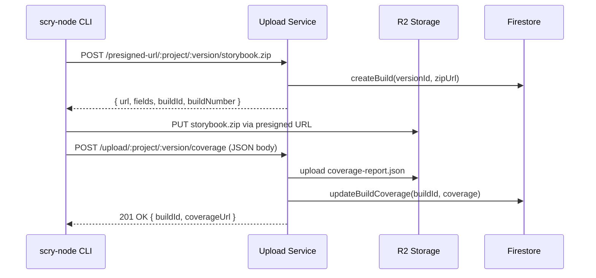

# Coverage-as-part-of-a-build (single build per version) — Implementation Plan

## Goal
Ensure a deploy that uploads Storybook + coverage results in **one Firestore Build** per `(project, version)`, with coverage stored on that build (and the raw coverage JSON stored in R2 under the same prefix as the ZIP).

## Current issue
`POST /presigned-url/:project/:version/:filename` currently creates a Firestore Build for **every** requested presigned upload (including coverage JSON), causing duplicate builds per version.

## Decision (approved)
**Option 3**: Do not use presigned uploads for coverage. Coverage is uploaded + attached via `POST /upload/:project/:version/coverage`.

- Presigned URL flow remains for the ZIP artifact (storybook).
- Coverage is treated as metadata attached to the existing build.

---

## Recommended deployer flow



---

## Implementation tasks

### Phase 1: Server-side changes (scry-storybook-upload-service)

#### 1.1 Update presigned URL handler to only create builds for ZIP files
**File:** [`scry-storybook-upload-service/src/app.ts`](scry-storybook-upload-service/src/app.ts:566)

**Current behavior (lines 628-649):**
```typescript
// Create Firestore build record if Firestore is configured
let buildId: string | undefined;
let buildNumber: number | undefined;

if (firestore) {
  try {
    const zipUrl = data.url.split('?')[0];
    const build = await firestore.createBuild(project, {
      versionId: version,
      zipUrl: zipUrl
    });
    buildId = build.id;
    buildNumber = build.buildNumber;
    console.log(`[INFO] Build record created for presigned upload: ID=${buildId}, Number=${buildNumber}`);
  } catch (firestoreError) {
    console.error('Firestore error (presigned URL succeeded):', firestoreError);
  }
}
```

**Required change:**
```typescript
// Only create Firestore build record for ZIP files
const isZipFile = filename.toLowerCase().endsWith('.zip');
let buildId: string | undefined;
let buildNumber: number | undefined;

if (firestore && isZipFile) {
  try {
    const zipUrl = data.url.split('?')[0];
    const build = await firestore.createBuild(project, {
      versionId: version,
      zipUrl: zipUrl
    });
    buildId = build.id;
    buildNumber = build.buildNumber;
    console.log(`[INFO] Build record created for presigned upload: ID=${buildId}, Number=${buildNumber}`);
  } catch (firestoreError) {
    console.error('Firestore error (presigned URL succeeded):', firestoreError);
  }
}
```

#### 1.2 Make getBuildByVersion deterministic (select latest)
**Files:**
- [`scry-storybook-upload-service/src/services/firestore/firestore.node.ts`](scry-storybook-upload-service/src/services/firestore/firestore.node.ts:115)
- [`scry-storybook-upload-service/src/services/firestore/firestore.worker.ts`](scry-storybook-upload-service/src/services/firestore/firestore.worker.ts:141)

**Current behavior (Node):**
```typescript
async getBuildByVersion(projectId: string, versionId: string): Promise<Build | null> {
  const snapshot = await this.db.collection(`projects/${projectId}/builds`)
    .where('versionId', '==', versionId)
    .limit(1)
    .get();
  // ...
}
```

**Required change (Node):**
```typescript
async getBuildByVersion(projectId: string, versionId: string): Promise<Build | null> {
  const snapshot = await this.db.collection(`projects/${projectId}/builds`)
    .where('versionId', '==', versionId)
    .orderBy('buildNumber', 'desc')
    .limit(1)
    .get();
  // ...
}
```

**Required change (Worker):**
```typescript
async getBuildByVersion(projectId: string, versionId: string): Promise<Build | null> {
  const structuredQuery = {
    from: [{ collectionId: 'builds' }],
    where: {
      fieldFilter: {
        field: { fieldPath: 'versionId' },
        op: 'EQUAL',
        value: { stringValue: versionId }
      }
    },
    orderBy: [{ field: { fieldPath: 'buildNumber' }, direction: 'DESCENDING' }],
    limit: 1
  };
  // ...
}
```

---

### Phase 2: CLI changes (scry-node)

#### 2.1 Replace presigned coverage upload with direct coverage endpoint
**File:** [`scry-node/lib/apiClient.js`](scry-node/lib/apiClient.js:138)

**Current behavior:**
```javascript
async function uploadCoverageReportDirectly(apiClient, target, coverageReport) {
  const buffer = Buffer.from(JSON.stringify(coverageReport, null, 2), 'utf-8');
  const presignedUrl = await requestPresignedUrl(apiClient, target, {
    fileName: 'coverage-report.json',
    contentType: 'application/json',
  });
  const upload = await putToPresignedUrl(presignedUrl, buffer, 'application/json');
  return { success: true, url: presignedUrl, status: upload.status };
}
```

**Required change:**
```javascript
/**
 * Upload coverage report via the coverage attach endpoint.
 * This uploads the JSON to R2 and attaches normalized coverage to the build.
 *
 * @param {axios.AxiosInstance} apiClient
 * @param {{project: string, version: string}} target
 * @param {any} coverageReport
 * @returns {Promise<{success: boolean, buildId?: string, coverageUrl?: string}>}
 */
async function uploadCoverageReportDirectly(apiClient, target, coverageReport) {
  const projectName = target.project || 'main';
  const versionName = target.version || 'latest';

  const response = await apiClient.post(
    `/upload/${projectName}/${versionName}/coverage`,
    coverageReport,
    {
      headers: {
        'Content-Type': 'application/json',
      },
    }
  );

  return {
    success: response.data?.success ?? true,
    buildId: response.data?.buildId,
    coverageUrl: response.data?.coverageUrl,
  };
}
```

#### 2.2 Update uploadBuild orchestration (optional cleanup)
**File:** [`scry-node/lib/apiClient.js`](scry-node/lib/apiClient.js:158)

The existing [`uploadBuild()`](scry-node/lib/apiClient.js:158) function already calls `uploadCoverageReportDirectly()` after the ZIP upload, so no structural change is needed. The function signature and return shape remain compatible.

---

### Phase 3: Tests

#### 3.1 Upload service e2e tests
**File:** [`scry-storybook-upload-service/e2e/tests/upload.test.ts`](scry-storybook-upload-service/e2e/tests/upload.test.ts:1)

Add test cases:
- Requesting presigned URL for `storybook.zip` creates a build
- Requesting presigned URL for `coverage-report.json` does NOT create a build
- Calling `/upload/:project/:version/coverage` attaches coverage to existing build
- Verify only one build exists for a version after full deploy flow

#### 3.2 CLI tests
**File:** [`scry-node/test/apiClient.test.js`](scry-node/test/apiClient.test.js:1)

Update tests for `uploadCoverageReportDirectly()` to mock the new endpoint instead of presigned URL flow.

---

### Phase 4: Documentation

#### 4.1 Update upload service spec
**File:** [`plans/scry-sbcov-integration/03-scry-storybook-upload-service-spec.md`](plans/scry-sbcov-integration/03-scry-storybook-upload-service-spec.md:1)

Update the "Request Examples" section to show the new recommended flow.

#### 4.2 Update CLI documentation
**File:** [`scry-node/docs/COVERAGE.md`](scry-node/docs/COVERAGE.md:1)

Document that coverage is now uploaded via the attach endpoint, not presigned URL.

---

## Code touchpoints summary

| File | Change |
|------|--------|
| `scry-storybook-upload-service/src/app.ts` | Gate `createBuild()` behind `isZipFile` check in presigned handler |
| `scry-storybook-upload-service/src/services/firestore/firestore.node.ts` | Add `orderBy('buildNumber', 'desc')` to `getBuildByVersion()` |
| `scry-storybook-upload-service/src/services/firestore/firestore.worker.ts` | Add `orderBy` to `getBuildByVersion()` structured query |
| `scry-node/lib/apiClient.js` | Replace presigned flow with POST to `/upload/:project/:version/coverage` |
| `scry-storybook-upload-service/e2e/tests/upload.test.ts` | Add tests for single-build-per-version behavior |
| `scry-node/test/apiClient.test.js` | Update coverage upload tests |

---

## Validation checklist

- [ ] Deploy storybook + coverage via CLI
- [ ] Verify Firestore shows exactly one build for the version
- [ ] Verify build document contains `coverage` field with normalized data
- [ ] Verify R2 contains both `storybook.zip` and `coverage-report.json` under `${project}/${version}/`
- [ ] Verify dashboard displays coverage correctly
- [ ] Run all e2e tests

---

## Optional: Cleanup existing duplicates

If duplicate builds already exist in Firestore, consider:
1. Manual cleanup via Firebase console
2. One-off admin script to archive/delete duplicates (keep highest buildNumber per versionId)

This is optional but recommended to avoid dashboard confusion.
